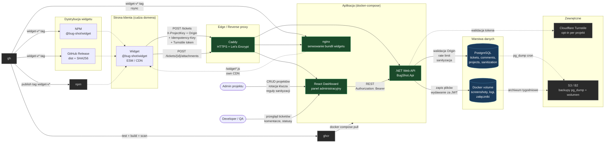

# BUG-SHOT

## Opis

**Bug-shot** to narzędzie dla automatyzacji pobierania raportów o błędach stron `WWW` oraz pobierania niezbędnej informacji do ich podalszym odtworzeniu.

System dostarcza do użytkownika końcowego, albo `QA` testera możliwość opisania problemu, robi zrzut ekranu i narzędzie pobiera informacji z przegłądarki. Pobrane dane przechodzą walidację i sanityzację, są czyszczone z informacji wrażliwych, po czym trafiają do bazy danych **Bug-shot**. Deweloperzy otrzymują dostęp do pełnego raportu przez osobne `GUI` dla podalszej analizy ta zmianę statusów.

Narzędzie jest dostarczane w formalnie kodu źródłowego oraz publicznego obrazu `Docker`, dostępnego przez `GHCR`.

### Wymagania fukcjonalne
1. Część klienta
    - **Wywołanie GUI:** Użytkownik powinien mieć możliwość otworzyć formularz zgłoszeniowy dla opisania problemu, poprzez przycisk albo plugin.
    - **Zbiór media danych**: System powinien robić zrzut ekranu obecnej strony.
    - **Automatyzacja pobrania danych technicznych:** Skrypt powinien automatycznie dołączać do raportu: adres `URL`, datę i czas, dane przegłądarki `User-Agent`.
    - **Zbiór logów:** Skrypt powinien pobierać logi z przegłądarki użytkownika.
    - **Wysyłanie:** Zebrany pakiet danych powinien być wysyłany poprzez API do serwera.
2. Część serwera
   - **Przyjmowanie danych:** Endpoint `POST` dla przyjmowanie raportów o błądzie.
   - **Ukrywanie danych wrażliwych**: Przed zapisaniem do bazy danych, system powinien ukrywać dane wrażliwe i podmieniać je na `***`.
   - **CRUD dla panelu:** Dostarczenie `API` dla czytania listy ticketów, przegłądanie szczegółów, dodawanie komentarzy i aktualizacji statusów.
3. Panel administratorski
   - **Przegłąd:** Zespół deweloperów powinien otrzymawać pełny raport w wygłądzie jednolitego `GUI`, z możliwość szczególnego badania osobnych elementów.
   - **Nawigacja:** Możliwość szukania, filtracja i paginacji złożonych tiketów.
   - **Aktualizacja:** Możliwość zmiany statusu tiketów. 
   - **Komunikacja:** Możliwość pozostawiania komentarzy do tiketu i przegłądania jego historii.

### Wymagania niefunkcjonalne
- **Bezpieczeństwo:** Dane wrażliwe nie mogą być przechowywane w bazie danych w formmie otwartej. 
- **Kompatybilność:** `API` backendu ma odpowiednio przyjmować `Cross-Origin` `POST` żądania, żeby zgłoszenie mogło poprawie działać na zewnętrznych domenach. 
- **Infrastruktura:** Projekt ma być odtwarzalnym i być diagnozowalnym przy pomocy narzędzia `docker-compose`.
- **Przechowywanie danych:** Zrzuty ekranu oraz inne pliki media, powinny być przechowywane w formie plików w nginx + `Docker Volume`, albo `S3`-kompatybilnej przestrzeni, baza danych przechowuje jedynie `URI` do nich.
- **Jakość kodu:** Kod, dane i dokumentacja powinny być przydatnym do daleszego rozwoju i utrzymania. 
- **Automatyzacja:** Zbieranie obrazów oraz sprawdzanie ma być automatyzowane.

### Stack technologiczny

```
Frontend: React
Backend: .NET
Baza danych: PostgreSQL
Konteneryzacja: Docker + docker-compose
CI/CD: GitHub Actions
```

## Uruchomienie lokalne

```powershell
cp .env.example .env
make dev
```

Panel wstaje na `http://localhost:5173`, API na `http://localhost:8080`, Swagger na `http://localhost:8080/swagger`.

Swagger stoi otworem tylko w środowisku `Development`. Poza nim trzeba go włączyć zmienną `SWAGGER_ENABLED` i podać `SWAGGER_USER` z `SWAGGER_PASSWORD`, bo dokument opisuje całe API razem z trasami za tokenem. Bez tej pary API nie wstanie, żeby włączony dokument nigdy nie wyszedł bez hasła.

`.env.example` ma komplet zmiennych potrzebnych do startu. Bez `JWT_SIGNING_KEY` API nie wstanie, bo klucz podpisu tokenów nie jest ustawieniem opcjonalnym. Konto do panelu powstaje przy pierwszym starcie z `ADMIN_EMAIL` i `ADMIN_PASSWORD`, wyłącznie wtedy gdy tabela `users` jest pusta. Do środowisk innych niż lokalne klucz generuje się osobno, na przykład `openssl rand -base64 48`.

Testy:

```powershell
make test
make e2e
```

`make test` uruchamia backend i frontend i potrzebuje bazy z `make dev`. `make e2e` stawia własne API i własny panel na osobnych portach, więc nie koliduje z działającym środowiskiem, ale bazy z compose też potrzebuje. Zależności obu zestawów instalują się same przy pierwszym uruchomieniu.

Testy backendu czyszczą tabele `tickets` i `users` w bazie deweloperskiej. Po ich uruchomieniu konto z `.env` wraca dopiero po wyczyszczeniu tabeli `users` i restarcie API.

Dane do sprawdzania panelu i analityki:

```powershell
make seed
make seed-reset
```

`make seed` dokłada do projektu `seed` kilkaset zgłoszeń z ostatnich 90 dni, ze zmianami statusów, komentarzami, załącznikami i trafieniami sanityzacji. Zgłoszenia idą przez API, więc środowisko z `docker-compose.dev.yml` musi chodzić, a daty przesuwa na koniec jedno zapytanie do bazy. `make seed-reset` najpierw kasuje zgłoszenia tego projektu razem z plikami. Liczbę zmienia `SEED_COUNT`, na przykład `make seed SEED_COUNT=10000` pod testy wydajności.

## Migracje bazy danych

W środowisku `Development` migracje Entity Framework Core są uruchamiane automatycznie przy starcie API.

Migrację można również uruchomić ręcznie z katalogu głównego repozytorium:

```powershell
make migrate
```

## Architektura



**Legenda przepływów:**
- Ciągła strzałka — runtime request (użytkownik → system)
- Kropkowana — asynchroniczna albo warunkowa (backup, opcjonalny Turnstile, publikacja artifactu)

**Uwagi:**
- Widget jest jedynym komponentem żyjącym poza naszą infrastrukturą — na cudzej domenie, dostarczany przez CDN
- Baza trzyma tylko `uri` do plików, same pliki leżą na wolumenie. Wydaje je API po sprawdzeniu tokena, bo załączniki są danymi użytkownika i nie mogą wisieć pod publicznym adresem. nginx serwuje bezpośrednio już tylko bundle widgetu, który z definicji jest publiczny
- Panel chroni JWT: access token w nagłówku, token odświeżający w cookie `HttpOnly`. Widget zostaje bez logowania, chroni go `projectKey`, `Origin` i jednorazowy token wysyłki
- Rate limit i walidacja `Origin` są w API, nie na Caddy — łatwiej ich odpalać per-endpoint
- Turnstile podłączany warunkowo per projekt (flaga w `projects`)
