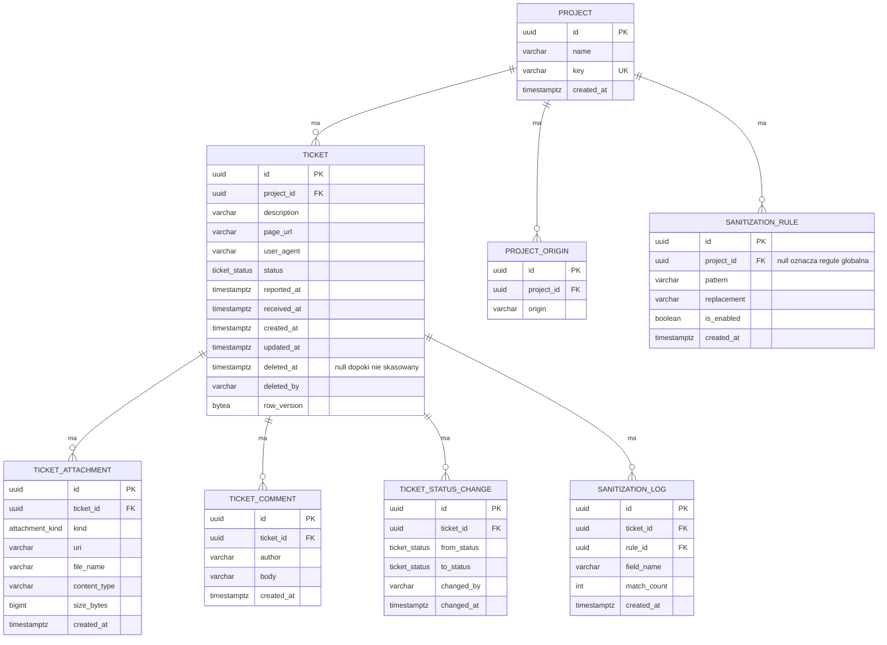

# Bug-shot: specyfikacja API

Dokument opisuje model danych, konwencje i decyzje projektowe. Powstał na bazie wstępnej specyfikacji uzgodnionej w zespole, uzupełnionej o to, co wyszło przy implementacji szkieletu backendu.

Dokładne kształty żądań i odpowiedzi generują się z kontrolerów i są dostępne pod `/openapi/v1.json`. Dokument produkuje wbudowane OpenAPI z .NET 10. Interfejsu do klikania na razie nie ma, jest sam dokument.

## Model danych



### Konwencje nazewnicze

Baza używa `snake_case` dla tabel, kolumn, kluczy i indeksów. Zapytania pisane ręcznie nie wymagają wtedy cudzysłowów, bo Postgres składa niecytowane identyfikatory do małych liter.

JSON w API używa `camelCase`. Warstwy są niezależne, więc kolumna `page_url` wychodzi na zewnątrz jako `pageUrl`.

### Enumy

`ticket_status` i `attachment_kind` to natywne typy wyliczeniowe Postgresa, nie tekst.

| Typ | W bazie | W JSON |
|---|---|---|
| `ticket_status` | `new`, `in_progress`, `resolved`, `rejected`, `deleted` | `New`, `InProgress`, `Resolved`, `Rejected`, `Deleted` |
| `attachment_kind` | `screenshot`, `user_upload`, `console_log` | `Screenshot`, `UserUpload`, `ConsoleLog` |

Dodanie nowej wartości wymaga migracji z `ALTER TYPE ... ADD VALUE`. Zmiana nazwy istniejącej jest kosztowniejsza i wymaga osobnej migracji.

### Indeksy

- `tickets(project_id, status, reported_at DESC)` dla listingu z filtrem
- `tickets(project_id, received_at DESC)` dla sortowania domyślnego
- `ticket_comments(ticket_id, created_at)`
- `ticket_status_changes(ticket_id, changed_at)`
- `ticket_attachments(ticket_id)`
- unikalny `projects(key)`
- unikalny `project_origins(project_id, origin)`

### Czas

Wszystkie znaczniki czasu są przechowywane jako `timestamptz`, czyli w UTC. Postgres nie przyjmuje przesunięcia innego niż zero, więc `reportedAt` przysłany przez klienta jest przeliczany na UTC przed zapisem. Oryginalne przesunięcie nie jest zachowywane: `2026-08-24T09:12:33+02:00` wraca jako `2026-08-24T07:12:33+00:00`.

Rozdzielenie pól jest celowe. `reported_at` pochodzi od klienta, którego zegar może być przestawiony. `received_at` stempluje serwer przy przyjęciu zgłoszenia i tylko na nim można polegać.

### Współbieżność

`created_at` jest nadawane przy dodaniu rekordu, a `updated_at` i `row_version` przy każdym zapisie ticketu. Robi to kontekst bazy, nie kod wołający, więc nie da się o tym zapomnieć w kontrolerze.

`row_version` chroni przed sytuacją, w której dwóch deweloperów zmienia ten sam ticket i jeden nadpisuje drugiego bez śladu. Postgres nie ma odpowiednika `rowversion` z SQL Servera, więc pole nadaje backend przy każdym zapisie. Na zewnątrz wychodzi jako nieprzezroczysty string base64. Klient ma go nie parsować, tylko odesłać w niezmienionej postaci przy aktualizacji statusu.

### Kasowanie

Kasowanie ticketu to tombstone. Zostają `id`, `project_id`, `status` ustawiony na `Deleted`, `deleted_at`, `deleted_by` oraz wpis w historii statusów. Znikają opis, adres strony, user agent, komentarze i załączniki, te ostatnie fizycznie z wolumenu.

Kasowanie projektu, który ma zgłoszenia, jest zablokowane na poziomie klucza obcego.

## Endpointy

Prefiks wersji `/api/v1`. Kolumna stanu mówi, czy endpoint istnieje w kodzie. Zaplanowane zwracają dziś 404.

| Endpoint | Stan | Opis |
|---|---|---|
| `POST /tickets` | działa | zgłoszenie z widgetu, patrz niżej |
| `GET /projects/{projectId}/tickets` | działa | lista dla dashboardu, filtr po statusie, szukanie, paginacja |
| `GET /tickets/{id}` | działa | szczegóły z załącznikami, licznikiem komentarzy i historią statusów |
| `POST /tickets/{id}/attachments` | planowane | multipart, autoryzacja przez `uploadToken` |
| `PATCH /tickets/{id}/status` | planowane | wymaga `If-Match` z `rowVersion`, konflikt daje 409 |
| `DELETE /tickets/{id}` | planowane | tombstone opisany wyżej |
| `POST /tickets/{id}/comments` | planowane | dodanie komentarza |
| `GET /tickets/{id}/comments` | planowane | lista komentarzy z paginacją |
| `DELETE /projects/{id}` | planowane | zablokowane, dopóki projekt ma zgłoszenia |

### POST /tickets

Jedyny endpoint integrowany spoza naszego kodu, więc kontrakt zapisany wprost.

```json
{
  "projectKey": "demo",
  "description": "Koszyk gubi produkty po odswiezeniu",
  "pageUrl": "https://acme.example/cart",
  "userAgent": "Mozilla/5.0 ...",
  "reportedAt": "2026-08-24T09:12:33+02:00"
}
```

Odpowiedź `201 Created` z identyfikatorem zgłoszenia.

Wymagane są `projectKey` i `description`. Opis do 1200 znaków, czyli tyle samo co limit w widgecie. `pageUrl` musi być poprawnym adresem. Nieznany `projectKey` daje 400 z błędem walidacji na tym polu.

Błędy walidacji wracają jako `ProblemDetails` zgodnie z RFC 9110, z mapą `errors` po nazwach pól.

Do dorobienia w kolejnym sprincie: nagłówek `Idempotency-Key`, walidacja nagłówka `Origin` względem `project_origins`, rate limit per IP i per `projectKey` oraz zwracanie `uploadToken` do wysyłki załączników.

### Zachowania listy

Rzeczy, których nie widać z sygnatury endpointu:

- `pageSize` jest przycinany do 100, `page` do minimum 1
- bez podanego `status` lista pomija tickety skasowane, bo tombstone nie ma czego pokazać. Jawne `status=Deleted` je zwróci
- `search` szuka po opisie i po adresie strony, bez rozróżniania wielkości liter
- `sort` przyjmuje `receivedAt:desc`, `receivedAt:asc`, `reportedAt:desc` i `reportedAt:asc`. Nierozpoznana wartość wpada w domyślne `receivedAt:desc`

## Pliki

Pliki nie trafiają do bazy. Baza trzyma `uri`, plik leży na wolumenie i serwuje go nginx z nagłówkami `Content-Disposition: attachment` oraz `X-Content-Type-Options: nosniff`.

Nazwa pliku na dysku to `{uuid}.{rozszerzenie}`. Nazwa podana przez klienta jest trzymana wyłącznie jako metadana i nigdy nie trafia do ścieżki.

Limity po stronie API: pięć plików po 10 MiB, plus logi konsoli jako osobny załącznik z limitem 256 KiB.

Dozwolone typy: `image/png`, `image/jpeg`, `application/pdf` oraz `text/plain` dla logów konsoli.

Typ rozpoznajemy po zawartości pliku, a nie po nagłówku `Content-Type` od klienta, bo ten łatwo podrobić i przemycić coś wykonywalnego pod zwykłym obrazkiem. Do tego walidacja strukturalna: obrazy muszą się zdekodować, PDF musi mieć nagłówek `%PDF-` i poprawny trailer. Rozmiar sprawdzany strumieniowo przed zapisem na dysk.

Logi konsoli są zwykłym załącznikiem z `kind = console_log`, a nie kolumną w bazie. Konsekwencja: wyszukiwanie nie obejmuje ich treści.

## Sanityzacja

Model danych jest przygotowany, logiki jeszcze nie ma.

Reguły siedzą w `sanitization_rules`, a nie w kolumnie `jsonb`, żeby dało się je indeksować i audytować pojedynczo. `project_id` równe `null` oznacza regułę globalną, na przykład dla adresów e-mail, numerów kart czy tokenów. Reguły projektowe rozszerzają globalne.

Maskowanie ma się odbywać po stronie backendu przed zapisem, dla opisu, adresu strony i user agenta w bazie oraz dla logów konsoli na wolumenie. Trafienia trafiają do `sanitization_logs` z nazwą pola i liczbą dopasowań, bez zapisywania oryginału. Ticket wraca do klienta zawsze w wersji zamaskowanej.

## CORS

Widget działa na cudzych domenach, więc `POST /tickets` ma osobną politykę dopuszczającą wyłącznie metodę `POST` i nagłówek `Content-Type`. Dashboard ma drugą, szerszą.

Dozwolone adresy są dziś czytane ze statycznej konfiguracji, z sekcji `Cors` w `appsettings`. Docelowo mają wynikać z tabeli `project_origins` powiązanej z `projectKey` ze zgłoszenia. To świadome uproszczenie na czas szkieletu.

## Dane startowe

Migracja tworzy jeden projekt, żeby dało się cokolwiek wywołać lokalnie.

| Pole | Wartość |
|---|---|
| `id` | `11111111-1111-1111-1111-111111111111` |
| `key` | `demo` |
| `name` | `Projekt demo` |
| dozwolony origin | `http://127.0.0.1:5500` |

Origin odpowiada adresowi, pod którym uruchamia się lokalnie widget.

Baza nie migruje się sama. `docker compose` stawia kontenery, ale schemat trzeba założyć osobno przez `dotnet ef database update`. Podpięcie tego do startu aplikacji albo do `Makefile` jest jeszcze do ustalenia.

## Poza zakresem

- uwierzytelnianie w dashboardzie. Pola `author` i `changedBy` przychodzą dziś z ciała żądania, więc można podać się za kogokolwiek. Docelowo mają pochodzić z sesji
- systemowe logowanie i audyt poza `sanitization_logs`. Miejsca wpięcia zostawiamy w kodzie, żeby dało się to dopiąć bez przepisywania warstwy
- odesłanie do sanityzacji i walidacji plików w głównym `README`
- twarda maszyna stanów przejść między statusami
- Redis jako cache przed Postgresem
