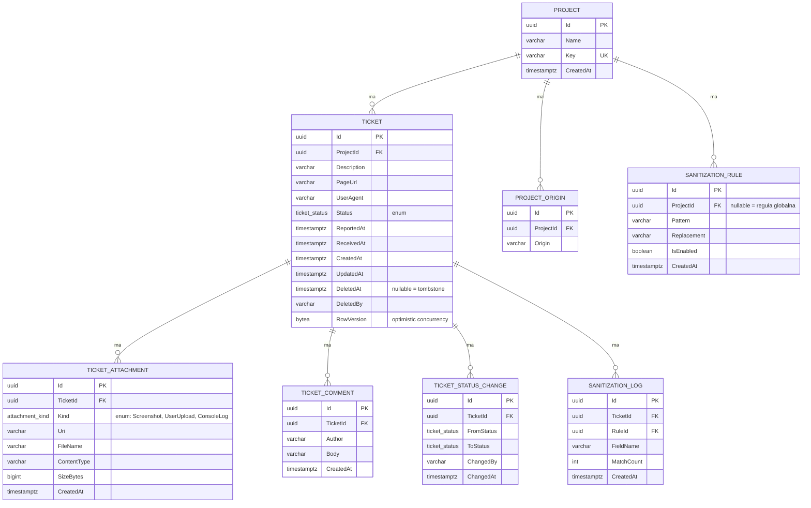

# Bug-shot — wstępna specyfikacja API

Dokument opisuje uzgodniony na tym etapie kształt API, modelu danych, zabezpieczeń i obsługi plików. Wszystko wersja MVP — rzeczy odłożone świadomie zebrane w sekcji „TODO / poza zakresem MVP".

## Model danych



### Decyzje

Statusy i rodzaje załącznika trzymamy jako Postgresowe enumy: `ticket_status` (`New`, `InProgress`, `Resolved`, `Rejected`, `Deleted`) i `attachment_kind` (`Screenshot`, `UserUpload`, `ConsoleLog`). Dodawanie nowych wartości: `ALTER TYPE ... ADD VALUE`. Zmiany/rename planujemy migracją.

`AllowedOrigin` z pierwotnej propozycji rozbity na osobną tabelę `PROJECT_ORIGIN` — projekt bywa hostowany na wielu domenach (prod, staging, preview).

`ConsoleLog` nie leci do bazy. Traktujemy go jak każdy inny załącznik — plik na volume, wpis w `TICKET_ATTACHMENT` z `Kind = 'ConsoleLog'`. Konsekwencja: search po ticketach idzie tylko po `Description` i `PageUrl`, nie po treści logów. Twardy limit `ConsoleLog` = 256 KiB po stronie API, przed zapisem na dysk.

`UpdatedAt` aktualizowany na każdym `SaveChanges`. `RowVersion` do optimistic concurrency przy `PATCH status` — konflikt zwraca `409`.

Kasowanie ticketu = soft-delete-lite (tombstone). Zostają: `Id`, `ProjectId`, `Status = 'Deleted'`, `DeletedAt`, `DeletedBy` + wpis w `TICKET_STATUS_CHANGE`. Znika: `Description`, `PageUrl`, `UserAgent`, komentarze, załączniki (w tym `ConsoleLog`) fizycznie z volume. Kasowanie projektu z aktywnymi ticketami dalej zablokowane.

### Sanityzacja

Reguły sanityzacji w osobnej tabeli `SANITIZATION_RULE` — nie `jsonb`, chcemy indeksować i audytować per reguła. `ProjectId` nullable = reguła globalna (email, karta, JWT, Bearer). Reguły projektowe nadpisują/rozszerzają globalne.

Sanityzacja odpala się po stronie backendu **przed** zapisem — dla `Description`, `PageUrl`, `UserAgent` w bazie oraz dla `ConsoleLog` na volume. Trafienia loguje się do `SANITIZATION_LOG` (`FieldName`, `MatchCount`, `RuleId`) — bez zapisu oryginału. Ticket wraca do klienta zawsze w wersji zamaskowanej.

### Indeksy

- `TICKET(ProjectId, Status, ReportedAt DESC)` — listing dashboardu
- `TICKET(ProjectId, ReceivedAt DESC)` — sortowanie domyślne
- `TICKET_COMMENT(TicketId, CreatedAt)`
- `TICKET_STATUS_CHANGE(TicketId, ChangedAt)`
- `TICKET_ATTACHMENT(TicketId)`
- unikalny `PROJECT(Key)`
- unikalny `PROJECT_ORIGIN(ProjectId, Origin)`

## Pliki

Pliki nie trafiają do bazy. Baza trzyma `Uri`, plik leży w volume i serwuje go nginx z nagłówkami `Content-Disposition: attachment` i `X-Content-Type-Options: nosniff`.

Nazwa pliku na dysku: `{uuid}.{ext}`. `FileName` klienta trzymany tylko jako metadana w bazie, nigdy nie używany w ścieżce.

## Endpointy

Prefix wersji: `/api/v1/...`, ustawiony globalnie w routingu. OpenAPI/Swashbuckle wpięty od dnia zero.

### Publiczny, dla widgetu

```
POST /api/v1/tickets
```

```json
{
  "projectKey": "acme-shop",
  "description": "Koszyk gubi produkty po odswiezeniu",
  "pageUrl": "https://acme.example/cart",
  "userAgent": "Mozilla/5.0 ...",
  "reportedAt": "2026-08-24T09:12:33+02:00"
}
```

`consoleLog` nie leci w JSON — idzie razem z załącznikami (multipart) z `Kind = 'ConsoleLog'`.

Nagłówki wymagane:
- `Idempotency-Key` — UUID od widgetu, retry nie tworzy duplikatu
- `Origin` — walidowany względem `PROJECT_ORIGIN` powiązanych z `projectKey`

Odpowiedź `201 Created`:

```json
{ "id": "uuid", "uploadToken": "opaque-string" }
```

Zabezpieczenia endpointu:
- walidacja `Origin` vs lista `PROJECT_ORIGIN`
- rate-limit per IP i per `projectKey`
- serwer stempluje `ReceivedAt` niezależnie od `reportedAt` z klienta

### Załączniki

```
POST /api/v1/tickets/{id}/attachments
```

- autoryzacja przez `uploadToken` zwrócony przy tworzeniu ticketu
- token: 5 min TTL, hashowany w bazie, powiązany z konkretnym `ticketId`, licznik użyć = limit załączników (5 plików × 10 MiB, plus `ConsoleLog` jako osobny „załącznik")
- multipart

Walidacja plików:
- whitelist typów: `image/png`, `image/jpeg`, `application/pdf`, `text/plain` (dla ConsoleLog)
- weryfikacja przez sprawdzenie magic bytes + strukturalną walidację zawartości (odpowiednik Apache Tiki — w .NET np. `MimeDetective`); nagłówek `Content-Type` od klienta jest ignorowany, bo łatwo go podrobić i przemycić RCE pod zwykłym obrazkiem
- obrazy muszą się zdekodować (`ImageSharp`), PDF musi mieć `%PDF-` i poprawny trailer
- rozmiar sprawdzany strumieniowo przed zapisem na dysk

### Dla dashboardu

```
GET    /api/v1/projects/{projectId}/tickets?status=&search=&sort=&page=&pageSize=
GET    /api/v1/tickets/{id}
PATCH  /api/v1/tickets/{id}/status
DELETE /api/v1/tickets/{id}
POST   /api/v1/tickets/{id}/comments
GET    /api/v1/tickets/{id}/comments?page=&pageSize=
DELETE /api/v1/projects/{id}
```

`GET .../tickets` — `search` po `Description` i `PageUrl`. `sort` domyślnie `receivedAt:desc`. Odpowiedź:

```json
{ "items": [...], "total": 123, "page": 1, "pageSize": 20 }
```

`GET /api/v1/tickets/{id}` — kształt odpowiedzi:

```json
{
  "id": "uuid",
  "projectId": "uuid",
  "projectKey": "acme-shop",
  "description": "...",
  "pageUrl": "...",
  "userAgent": "...",
  "status": "InProgress",
  "reportedAt": "2026-08-24T09:12:33+02:00",
  "receivedAt": "2026-08-24T07:12:34Z",
  "createdAt": "...",
  "updatedAt": "...",
  "rowVersion": "opaque-string",
  "attachments": [
    { "id": "uuid", "kind": "Screenshot", "uri": "https://.../abc.png",
      "fileName": "shot.png", "contentType": "image/png", "sizeBytes": 12345 }
  ],
  "consoleLogUri": "https://.../console.log",
  "commentCount": 4,
  "statusHistory": [
    { "fromStatus": "New", "toStatus": "InProgress",
      "changedBy": "bartek", "changedAt": "..." }
  ]
}
```

`PATCH .../status`:

```json
{ "status": "InProgress", "changedBy": "bartek" }
```

Wymaga nagłówka `If-Match: <rowVersion>`. Konflikt → `409 Conflict`. Backend odrzuca nieznane wartości statusu (enum). Twardej state machine dozwolonych przejść na MVP nie ma.

`POST .../comments`:

```json
{ "author": "bartek", "body": "Odtworzone na stagingu" }
```

`GET .../comments` — paginacja `page`/`pageSize`, sort `createdAt:asc`.

## TODO / poza zakresem MVP

- Systemowe logowanie (structured logs, audit trail poza `SANITIZATION_LOG`) — świadomie odkładamy, hooki w kodzie zostawiamy żeby dopiąć bez refaktoru.
- Twarda state machine przejść statusów.
- Autoryzacja użytkownika w dashboardzie — pole `changedBy`/`author` obecnie z body, docelowo z sesji/JWT. Następny etap dyskusji.
- Dopisać do głównego README informację o sanityzacji i walidacji (odesłanie do tego dokumentu).
