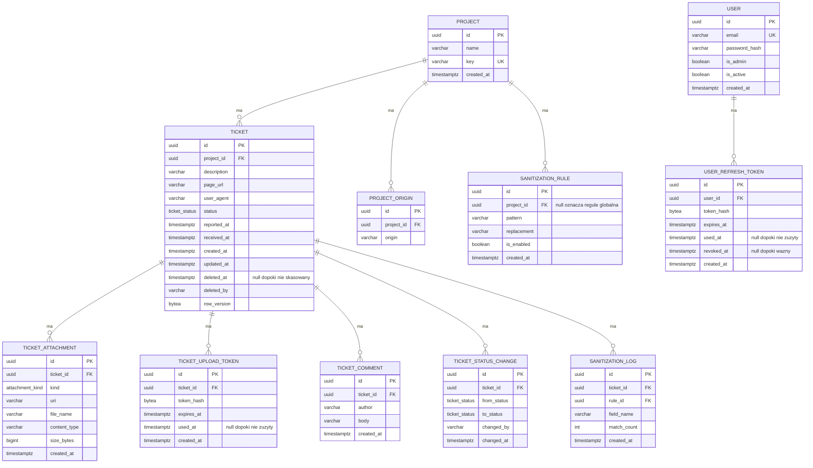

# Bug-shot: specyfikacja API

Dokument opisuje model danych, konwencje i decyzje projektowe. Powstał na bazie wstępnej specyfikacji uzgodnionej w zespole, uzupełnionej o to, co wyszło przy implementacji szkieletu backendu.

Dokładne kształty żądań i odpowiedzi generują się z kontrolerów i są dostępne pod `/openapi/v1.json`. Dokument produkuje wbudowane OpenAPI z .NET 10. Interfejsu do klikania na razie nie ma, jest sam dokument.

## Model danych



### Konwencje nazewnicze

Baza używa `snake_case` dla tabel, kolumn, kluczy i indeksów. Zapytania pisane ręcznie nie wymagają wtedy cudzysłowów, bo Postgres składa niecytowane identyfikatory do małych liter.

JSON w API używa `camelCase`. Warstwy są niezależne, więc kolumna `page_url` wychodzi na zewnątrz jako `pageUrl`.

### Enumy

`ticket_status` i `attachment_kind` to natywne typy wyliczeniowe Postgresa, nie tekst.

| Typ | W bazie | W JSON |
|---|---|---|
| `ticket_status` | `new`, `in_progress`, `resolved`, `rejected`, `deleted` | `New`, `InProgress`, `Resolved`, `Rejected`, `Deleted` |
| `attachment_kind` | `screenshot`, `user_upload`, `console_log` | `Screenshot`, `UserUpload`, `ConsoleLog` |

Dodanie nowej wartości wymaga migracji z `ALTER TYPE ... ADD VALUE`. Zmiana nazwy istniejącej jest kosztowniejsza i wymaga osobnej migracji.

### Indeksy

- `tickets(project_id, status, reported_at DESC)` dla listingu z filtrem
- `tickets(project_id, received_at DESC)` dla sortowania domyślnego
- `ticket_comments(ticket_id, created_at)`
- `ticket_status_changes(ticket_id, changed_at)`
- `ticket_attachments(ticket_id)`
- `ticket_upload_tokens(ticket_id)`
- unikalny `ticket_upload_tokens(token_hash)`
- unikalny `projects(key)`
- unikalny `project_origins(project_id, origin)`
- unikalny `users(email)`
- unikalny `user_refresh_tokens(token_hash)`
- `user_refresh_tokens(user_id)`

### Czas

Wszystkie znaczniki czasu są przechowywane jako `timestamptz`, czyli w UTC. Postgres nie przyjmuje przesunięcia innego niż zero, więc `reportedAt` przysłany przez klienta jest przeliczany na UTC przed zapisem. Oryginalne przesunięcie nie jest zachowywane: `2026-08-24T09:12:33+02:00` wraca jako `2026-08-24T07:12:33+00:00`.

Rozdzielenie pól jest celowe. `reported_at` pochodzi od klienta, którego zegar może być przestawiony. `received_at` stempluje serwer przy przyjęciu zgłoszenia i tylko na nim można polegać.

### Współbieżność

`created_at` jest nadawane przy dodaniu rekordu, a `updated_at` i `row_version` przy każdym zapisie ticketu. Robi to kontekst bazy, nie kod wołający, więc nie da się o tym zapomnieć w kontrolerze.

`row_version` chroni przed sytuacją, w której dwóch deweloperów zmienia ten sam ticket i jeden nadpisuje drugiego bez śladu. Postgres nie ma odpowiednika `rowversion` z SQL Servera, więc pole nadaje backend przy każdym zapisie. Na zewnątrz wychodzi jako nieprzezroczysty string base64. Klient ma go nie parsować, tylko odesłać w niezmienionej postaci przy aktualizacji statusu.

### Kasowanie

Kasowanie ticketu to tombstone. Zostają `id`, `project_id`, `status` ustawiony na `Deleted`, `deleted_at`, `deleted_by` oraz wpis w historii statusów. Znikają opis, adres strony, user agent, komentarze i załączniki, te ostatnie fizycznie z wolumenu.

Kasowanie projektu, który ma zgłoszenia, jest zablokowane na poziomie klucza obcego.

Tombstone zostaje widoczny. `GET /tickets/{id}` zwraca go z pustymi polami i statusem `Deleted`, a lista pokazuje go po jawnym `status=Deleted`. Skoro odczyt działa, to zapis na tombstone nie jest brakiem zasobu, tylko konfliktem z jego stanem, i dostaje `409` z `currentStatus` w `ProblemDetails`. Dotyczy to dziś `PATCH /tickets/{id}/status` oraz `POST /tickets/{id}/comments`.

## Endpointy

Prefiks wersji `/api/v1`. Kolumna stanu mówi, czy endpoint istnieje w kodzie. Zaplanowane zwracają dziś 404.

Domyślnie każdy endpoint wymaga tokena, wyjątki wylicza sekcja `Uwierzytelnianie`.

| Endpoint | Stan | Opis |
|---|---|---|
| `POST /tickets` | działa | zgłoszenie z widgetu, zwraca `uploadToken`, patrz niżej |
| `GET /projects/{projectId}/tickets` | działa | lista dla dashboardu, filtr po statusie, szukanie, paginacja |
| `GET /tickets/{id}` | działa | szczegóły z załącznikami, licznikiem komentarzy i historią statusów |
| `POST /tickets/{id}/attachments` | działa | multipart, autoryzacja przez `uploadToken` |
| `PATCH /tickets/{id}/status` | działa | wymaga `If-Match` z `rowVersion`, konflikt daje 409 |
| `DELETE /tickets/{id}` | działa | tombstone ticketu i usunięcie danych/załączników |
| `POST /tickets/{id}/comments` | działa | dodanie komentarza, tombstone daje 409 |
| `GET /tickets/{id}/comments` | działa | lista komentarzy z paginacją |
| `GET /attachments/{id}/download` | działa | plik załącznika, wyłącznie dla zalogowanych |
| `POST /auth/login` | działa | e-mail i hasło w zamian za access token i cookie z refreshem |
| `POST /auth/refresh` | działa | rotacja tokena odświeżającego z cookie |
| `POST /auth/logout` | działa | unieważnia token z cookie i czyści cookie |
| `GET /auth/me` | działa | konto właściciela tokena |
| `GET /users` | działa | lista kont, tylko dla administratora |
| `POST /users` | działa | nowe konto, tylko dla administratora |
| `PATCH /users/{id}/deactivate` | działa | wyłączenie konta, tylko dla administratora |
| `POST /users/{id}/reset-password` | działa | ustawienie nowego hasła, tylko dla administratora |
| `DELETE /projects/{id}` | planowane | zablokowane, dopóki projekt ma zgłoszenia |

### POST /tickets

Jedyny endpoint integrowany spoza naszego kodu, więc kontrakt zapisany wprost.

```json
{
  "projectKey": "demo",
  "description": "Koszyk gubi produkty po odswiezeniu",
  "pageUrl": "https://acme.example/cart",
  "userAgent": "Mozilla/5.0 ...",
  "reportedAt": "2026-08-24T09:12:33+02:00"
}
```

Odpowiedź `201 Created` z identyfikatorem zgłoszenia i jednorazowym tokenem do wysyłki załączników.

```json
{
  "id": "6f1c2a54-0f9d-4f2e-9a8b-2f7d1c3b5e10",
  "uploadToken": "<token, 43 znaki base64url>",
  "uploadTokenExpiresAt": "2026-08-27T12:18:41+00:00"
}
```

Token wraca wyłącznie w tej odpowiedzi. W bazie leży sam skrót SHA-256, więc nie da się go odzyskać ani odtworzyć po stronie serwera. Ważność to 15 minut od utworzenia zgłoszenia, licząc do momentu walidacji, a nie do rozpoczęcia wysyłki. Token jest jednorazowy: pierwsze udane użycie stempluje `used_at` i kolejna próba dostaje 401. Sposób przekazania tokena opisuje sekcja `POST /tickets/{id}/attachments`.

Wymagane są `projectKey` i `description`. Opis do 1200 znaków, czyli tyle samo co limit w widgecie. `pageUrl` musi być poprawnym adresem. Nieznany `projectKey` daje 400 z błędem walidacji na tym polu.

Błędy walidacji wracają jako `ProblemDetails` zgodnie z RFC 9110, z mapą `errors` po nazwach pól.

Do dorobienia w kolejnym sprincie: rate limit per IP i per `projectKey`.

### Origin i Idempotency-Key

Walidacja dzieje się w kontrolerze, niezależnie od polityki CORS: CORS chroni tylko żądania z przeglądarki, a `POST /tickets` da się odpytać też spoza niej. Nagłówek `Origin` musi znaleźć się w `project_origins` projektu wskazanego przez `projectKey`. Brak nagłówka i pusta lista originów projektu kończą się tak samo, `403` z `ProblemDetails`.

Porównanie ignoruje wielkość liter. Przeglądarka zgodnie z RFC 6454 i tak wysyła schemat oraz host małymi literami, ale wartości w `project_origins` wpisuje człowiek, więc `https://Sklep.example` w bazie nie może cicho blokować ruchu. Reszta normalizacji, na przykład ucięcie końcowego ukośnika, należy do ekranu administracyjnego przy zapisie, a nie do tego sprawdzenia.

Nagłówek `Idempotency-Key` jest opcjonalny. Jego brak tylko loguje ostrzeżenie, request idzie dalej bez ochrony przed duplikatem. Gdy jest obecny:

- pierwsze użycie klucza zapisuje w cache skrót żądania razem z wynikiem, na 24h
- powtórka z tym samym kluczem i tym samym ciałem zwraca dokładnie ten sam `201`, z tym samym `id` i `uploadToken`, bez tworzenia nowego ticketu
- powtórka z tym samym kluczem i innym ciałem dostaje `409`

Klucz jest scope'owany per projekt, więc ten sam klucz w dwóch różnych projektach nie koliduje. Skrót liczony jest z modelu `CreateTicketRequest` po walidacji, a nie z surowych bajtów ciała, bo model bindingu i tak konsumuje strumień przed wejściem do akcji.

Cache siedzi za `IDistributedCache`, dziś zarejestrowanym jako `AddDistributedMemoryCache()` w `Program.cs`. Podmiana na Redis to jedna linia tam, bez zmian w kontrolerze. Świadome uproszczenie: brak blokady na czas zapisu do cache, więc dwa równoległe żądania z tym samym kluczem i pustym cache mogą oba trafić do bazy zanim pierwsze zdąży się zapisać.

### POST /tickets/{id}/attachments

Drugi endpoint wołany spoza naszego kodu, zaraz po `POST /tickets`.

Token idzie w nagłówku `X-Upload-Token`, a nie w ciele, żeby dało się odrzucić żądanie przed odczytem strumienia. Dlatego ta trasa ma własną politykę CORS, opisaną niżej.

Ciało to `multipart/form-data` z trzema rozpoznawanymi polami. Każde jest opcjonalne, ale puste żądanie dostaje 400.

| Pole | Ile | Limit | `kind` w bazie |
|---|---|---|---|
| `screenshot` | 1 | 10 MiB | `screenshot` |
| `files` | do 5 łącznie ze zrzutem | 10 MiB każdy | `user_upload` |
| `consoleLog` | 1 | 256 KiB | `console_log` |

Odpowiedź `201 Created` z listą zapisanych załączników, każdy z `id`, `kind`, `fileName`, `contentType` i `sizeBytes`.

Kody błędów:

| Kod | Kiedy |
|---|---|
| 400 | zawartość pliku nie pasuje do żadnego dozwolonego typu, drugi zrzut lub drugi log w jednym żądaniu, więcej niż pięć plików, nieznane pole formularza, ciało nie jest multipart albo nie przyszedł żaden plik |
| 401 | brak nagłówka, token nieznany, wygasły, zużyty albo wystawiony dla innego zgłoszenia |
| 413 | pojedynczy plik lub log przekracza swój limit, albo całe żądanie przekracza sumę limitów |

Kolejność sprawdzeń jest sztywna: nagłówek z tokenem, potem `Content-Length` i typ ciała, dopiero na końcu zawartość plików. Licznik bajtów leci własny, w trakcie zapisu, więc plik ponad limit przerywa transfer zamiast czekać na koniec strumienia.

Całość idzie w jednej transakcji, a token jest stemplowany jednym atomowym zapisem, zanim ruszy odczyt plików. Wynikają z tego dwie rzeczy istotne dla klienta:

- dwa równoległe żądania z tym samym tokenem nie przejdą oba, drugie dostanie 401
- odpowiedź 400 i 413 nie zużywa tokena, bo transakcja się cofa i pliki znikają z dysku. Ponowienie po poprawieniu pliku zadziała. Zużywa go dopiero 201

Nazwa pliku na dysku to `{uuid}.{rozszerzenie}`, a `uri` w bazie jest ścieżką względną pod `/attachments/`. Na zewnątrz nie wychodzi, patrz sekcja `Pliki`.

### PATCH /tickets/{id}/status

Zmiana statusu z dashboardu. Ciało ma nowy status i autora zmiany, wersję ticketu niesie nagłówek.

```json
{
  "status": "InProgress",
  "changedBy": "bartek"
}
```

Nagłówek `If-Match` jest wymagany i niesie `rowVersion` z ostatniego `GET /tickets/{id}`. Wartość idzie w niezmienionej postaci, ale opakowanie jej w cudzysłowy etaga też przejdzie. Odpowiedź `200 OK` oddaje nowy `rowVersion`, więc kolejna zmiana nie potrzebuje ponownego `GET`.

```json
{
  "id": "6f1c2a54-0f9d-4f2e-9a8b-2f7d1c3b5e10",
  "status": "InProgress",
  "rowVersion": "<base64>",
  "updatedAt": "2026-09-08T11:04:22+00:00"
}
```

Każda zmiana dopisuje wpis w `ticket_status_changes` z `from_status`, `to_status`, `changed_by` i `changed_at`. Wysłanie statusu, który ticket już ma, nie jest zmianą: kończy się `200` z niezmienionym `rowVersion` i nie zostawia śladu w historii.

Kody błędów:

| Kod | Kiedy |
|---|---|
| 400 | brak `status` albo `changedBy`, nieznana wartość statusu, `status` równy `Deleted` |
| 404 | nie ma takiego zgłoszenia |
| 409 | `If-Match` nie zgadza się z aktualnym `rowVersion`, albo ticket jest tombstone |
| 428 | brak nagłówka `If-Match` |

Ciało `409` to `ProblemDetails` z dwoma dodatkowymi polami, `currentStatus` i `rowVersion`. Dzięki temu dashboard po konflikcie pokazuje aktualny stan bez dodatkowego `GET`. Wartość `*` w `If-Match` nie jest obsługiwana i wpada w `409`, bo zgoda na nadpisanie cudzej zmiany przeczy całemu mechanizmowi.

Kasowanie idzie wyłącznie przez `DELETE /tickets/{id}`, więc `Deleted` w ciele dostaje 400. W drugą stronę tombstone nie wraca do żywego statusu, bo opis, adres strony i załączniki są już skasowane i nie ma czego przywrócić.

Sprawdzenie wersji leci dwa razy. Najpierw porównanie `If-Match` z odczytanym `rowVersion`, potem `row_version` w warunku `UPDATE`, bo jest tokenem współbieżności EF. Drugie łapie zapis, który wszedł między odczytem a zapisem, i też kończy się `409`.

### Zachowania listy

Rzeczy, których nie widać z sygnatury endpointu:

- `pageSize` jest przycinany do 100, `page` do minimum 1
- bez podanego `status` lista pomija tickety skasowane, bo tombstone nie ma czego pokazać. Jawne `status=Deleted` je zwróci
- `search` szuka po opisie i po adresie strony, bez rozróżniania wielkości liter
- `sort` przyjmuje `receivedAt:desc`, `receivedAt:asc`, `reportedAt:desc` i `reportedAt:asc`. Nierozpoznana wartość wpada w domyślne `receivedAt:desc`
- sortowanie po `reportedAt` schodzi na `receivedAt` tam gdzie `reportedAt` jest puste. Bez tego zgłoszenia bez czasu z przeglądarki lądowały na końcu listy przy `asc` i na początku przy `desc`, niezależnie od daty pokazanej w tabeli
- każde sortowanie domyka się identyfikatorem ticketu. Bez tego zgłoszenia o równych znacznikach czasu mają dowolną kolejność i potrafią powtórzyć się na dwóch stronach albo nie trafić na żadną

## Uwierzytelnianie

Panel chroni JWT. Zasada jest odwrócona względem listy wyjątków: autoryzacja jest wymagana domyślnie i to endpoint musi powiedzieć, że jej nie chce. Nowa trasa dodana bez namysłu jest wtedy zamknięta, a nie otwarta.

Bez tokena działają dokładnie trzy rzeczy:

- `POST /tickets` i `POST /tickets/{id}/attachments`, bo woła je widget z cudzej domeny i nie ma skąd wziąć konta. Chroni je `projectKey`, `Origin` i jednorazowy `uploadToken`
- `/auth/login`, `/auth/refresh` i `/auth/logout`, bo to jest właśnie zakładanie i zamykanie sesji. Wylogowanie jest anonimowe celowo, żeby działało też z wygasłym access tokenem

### Tokeny

| Token | Życie | Gdzie |
|---|---|---|
| access | 15 minut | nagłówek `Authorization: Bearer` |
| refresh | 7 dni | cookie `bugshot_refresh`, `HttpOnly` |

Access token nosi `sub` z identyfikatorem konta, `email` oraz `role` równe `admin` dla administratorów. Podpis to HS256 kluczem z `JWT_SIGNING_KEY`. Bez tej zmiennej API nie wstaje, bo klucz podpisu nie jest ustawieniem opcjonalnym. Tolerancja na rozjazd zegarów jest wyłączona, więc kwadrans to naprawdę kwadrans.

Cookie z refreshem ma `HttpOnly`, `Secure`, `SameSite=Lax` i `Path=/api/v1/auth`. `Lax` wystarcza, bo panel i API są same-site zarówno lokalnie jak i za wspólnym proxy, a przy okazji zamyka CSRF. Ścieżka ogranicza wysyłanie cookie do tych endpointów, które je czytają.

Wynika z tego wymaganie na konfigurację: panel i API muszą stać pod tym samym hostem. `http://localhost:5173` z API pod `http://127.0.0.1:8080` to dla przeglądarki dwie różne witryny, więc cookie nie pojedzie i sesja nie przeżyje odświeżenia strony, mimo że samo logowanie zadziała. Port nie ma znaczenia, host ma.

Access token żyje w pamięci karty, nie w `localStorage`. Po odświeżeniu strony panel odtwarza sesję jednym `POST /auth/refresh`, bo cookie przeżywa przeładowanie.

### Rotacja

Każde `POST /auth/refresh` zużywa token i wystawia nowy. W bazie leży sam SHA-256, zużycie to jeden atomowy `UPDATE`, więc dwa równoległe żądania z tym samym tokenem nie przejdą oba.

Token zużyty albo unieważniony, podany po raz drugi, kończy się `401` i unieważnieniem wszystkich sesji tego konta. Wyjątkiem jest powtórka w ciągu 30 sekund od zużycia: dostaje `401`, ale bez zamykania sesji, bo to zwykle ta sama karta wysłała żądanie dwa razy, a nie ktoś obcy z ukradzionym tokenem.

Dezaktywacja konta i reset hasła też unieważniają wszystkie jego tokeny. Bez tego wyłączone konto zostawałoby w panelu do końca ważności refresha.

Sam access token to za mało, żeby przejść dalej: przy każdym żądaniu sprawdzane jest, czy konto nadal jest aktywne. Bez tego wyłączone konto pracowałoby jeszcze kwadrans, do wygaśnięcia tokena, który dostało przed wyłączeniem.

### Konta

`users` trzyma `email`, `password_hash`, `is_admin` i `is_active`. Każdy zalogowany widzi wszystkie projekty tej instancji, podziału uprawnień na projekty nie ma.

Hasła idą przez bcrypt z kosztem 12. bcrypt liczy tylko pierwsze 72 bajty, więc dłuższe hasło jest odrzucane przy walidacji zamiast po cichu skracane. Minimum to 12 znaków.

Nieznany adres, złe hasło i konto wyłączone dają identyczne `401` z tym samym opisem. Przy nieznanym adresie i tak liczony jest hash na stałej wartości, żeby czas odpowiedzi nie zdradzał, które konta istnieją.

Pierwsze konto powstaje przy starcie API z `ADMIN_EMAIL` i `ADMIN_PASSWORD`, wyłącznie gdy tabela `users` jest pusta. Skasowany administrator nie wraca więc przy każdym restarcie. Brak którejś ze zmiennych zostawia ostrzeżenie w logu i nie tworzy konta, czyli do panelu nie da się wejść, ale API wstaje.

`POST /users`, `PATCH /users/{id}/deactivate` i `POST /users/{id}/reset-password` są tylko dla `is_admin`. Administrator nie może wyłączyć własnego konta, bo ostatni administrator zamknąłby się na zewnątrz. Ekranu do tego w panelu jeszcze nie ma, konta zakłada się żądaniem.

## Pliki

Pliki nie trafiają do bazy. Baza trzyma `uri`, plik leży na wolumenie, a wydaje go API przez `GET /attachments/{id}/download` po sprawdzeniu tokena. nginx zostaje przy `/widgets/`, bo bundle widgetu musi być publiczny, a załączniki są danymi użytkownika.

`uri` jest lokalizacją pliku po stronie serwera i nie wychodzi już w odpowiedziach API. Klient dostaje `id` załącznika i tylko ono prowadzi do treści.

Ponieważ `Authorization` nie da się dokleić do ``, dashboard pobiera załącznik zwykłym żądaniem i pokazuje go jako `blob:`. Przy przeniesieniu plików do S3 albo Garage ten sam endpoint przestanie streamować i zacznie przekierowywać na podpisany adres, bez zmian po stronie klienta.

Nazwa pliku na dysku to `{uuid}.{rozszerzenie}`. Nazwa podana przez klienta jest trzymana wyłącznie jako metadana i nigdy nie trafia do ścieżki.

Limity po stronie API: pięć plików po 10 MiB, plus logi konsoli jako osobny załącznik z limitem 256 KiB.

Dozwolone typy: `image/png`, `image/jpeg`, `application/pdf` oraz `text/plain` dla logów konsoli.

Typ rozpoznajemy po zawartości pliku, a nie po nagłówku `Content-Type` od klienta, bo ten łatwo podrobić i przemycić coś wykonywalnego pod zwykłym obrazkiem. Sprawdzamy sygnaturę na początku pliku i domknięcie na końcu: PNG kończy się chunkiem `IEND`, JPEG znacznikiem `FF D9`, PDF trailerem `%%EOF`. Log konsoli musi być poprawnym UTF-8. Rozmiar sprawdzany strumieniowo w trakcie zapisu.

Nie dekodujemy obrazów w całości, bo wymagałoby to dociągnięcia biblioteki graficznej. Plik z poprawną sygnaturą i poprawnym domknięciem, ale uszkodzony w środku, przejdzie walidację i wyświetli się jako zepsuty obrazek w dashboardzie.

Logi konsoli są zwykłym załącznikiem z `kind = console_log`, a nie kolumną w bazie. Konsekwencja: wyszukiwanie nie obejmuje ich treści.

## Sanityzacja

Model danych jest przygotowany, logiki jeszcze nie ma.

Reguły siedzą w `sanitization_rules`, a nie w kolumnie `jsonb`, żeby dało się je indeksować i audytować pojedynczo. `project_id` równe `null` oznacza regułę globalną, na przykład dla adresów e-mail, numerów kart czy tokenów. Reguły projektowe rozszerzają globalne.

Maskowanie ma się odbywać po stronie backendu przed zapisem, dla opisu, adresu strony i user agenta w bazie oraz dla logów konsoli na wolumenie. Trafienia trafiają do `sanitization_logs` z nazwą pola i liczbą dopasowań, bez zapisywania oryginału. Ticket wraca do klienta zawsze w wersji zamaskowanej.

## CORS

Widget działa na cudzych domenach, więc `POST /tickets` ma osobną politykę dopuszczającą wyłącznie metodę `POST` i nagłówek `Content-Type`. Dashboard ma drugą, szerszą, i jako jedyna dopuszcza ona ciasteczka, bo panel dosyła cookie z tokenem odświeżającym. Polityki widgetu ciasteczek nie przyjmują.

Wysyłka załączników ma trzecią, `widget-upload`, identyczną z polityką widgetu poza dodatkowym nagłówkiem `X-Upload-Token`. Rozdzielenie jest celowe: gdyby obie trasy dzieliły jedną politykę, poszerzenie nagłówków pod załączniki rozluźniłoby przy okazji `POST /tickets`.

Dozwolone adresy są dziś czytane ze statycznej konfiguracji, z sekcji `Cors` w `appsettings`. Docelowo mają wynikać z tabeli `project_origins` powiązanej z `projectKey` ze zgłoszenia. To świadome uproszczenie na czas szkieletu.

## Dane startowe

Migracja tworzy jeden projekt, żeby dało się cokolwiek wywołać lokalnie.

| Pole | Wartość |
|---|---|
| `id` | `11111111-1111-1111-1111-111111111111` |
| `key` | `demo` |
| `name` | `Projekt demo` |
| dozwolony origin | `http://127.0.0.1:5500` |

Origin odpowiada adresowi, pod którym uruchamia się lokalnie widget.

Konto administratora nie jest częścią migracji, bo hash hasła nie jest wartością znaną w czasie kompilacji. Powstaje przy starcie API z `ADMIN_EMAIL` i `ADMIN_PASSWORD`, opis w sekcji `Uwierzytelnianie`.

W środowisku `Development` migracje wykonują się przy starcie API. Poza nim schemat zakłada się przez `make migrate`.

## Poza zakresem

- `author`, `changedBy` i `deletedBy` przychodzą dalej z ciała żądania albo są wpisane na sztywno, więc można podać się za kogokolwiek. Uwierzytelnianie już jest, więc docelowo mają pochodzić z tokena. To osobna zmiana kontraktu `POST /comments`, `PATCH /status` i `DELETE`
- rate limit na `/auth/login`. Idzie razem z rate limitem na `POST /tickets`, bo to jeden mechanizm
- systemowe logowanie i audyt poza `sanitization_logs`. Miejsca wpięcia zostawiamy w kodzie, żeby dało się to dopiąć bez przepisywania warstwy
- odesłanie do sanityzacji i walidacji plików w głównym `README`
- twarda maszyna stanów przejść między statusami
- Redis jako cache przed Postgresem
