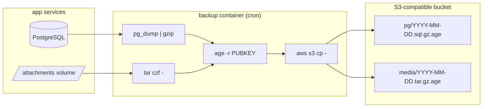
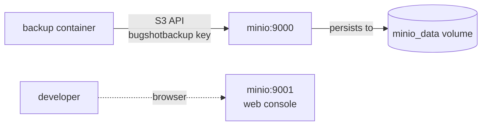
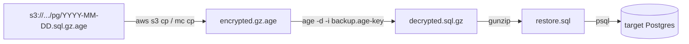

# Backups

Encrypted, streamed backups of Postgres and the attachments volume to any S3-compatible bucket.

## Architecture



- **Stream end-to-end.** Plaintext bytes never touch disk.
- **Asymmetric encryption.** The container holds only the public key. Private key stays offline; without it, the bucket contents are noise.
- **S3-agnostic.** Anything that speaks S3 (R2, B2, MinIO, Garage, AWS S3) works with only `S3_ENDPOINT_URL` and credentials changing.

## Schedule

Cron in the backup container, UTC:

| Job | When | Retention |
|---|---|---|
| `backup-pg.sh` | daily 03:00 | 14 days |
| `backup-media.sh` | Sunday 04:00 | 8 weeks |
| `cleanup.sh` | daily 05:00 | — |

## 1. Generate the age keypair

```bash
docker run --rm alpine:3.20 sh -c "apk add -q age && age-keygen" > backup.age-key
chmod 600 backup.age-key

# extract public key (feed to prod as BACKUP_AGE_PUBLIC_KEY)
grep '^# public key:' backup.age-key | sed 's/# public key: //'
```

**Keep the private key offline.** Password manager, hardware key, sealed envelope — anywhere the running production system cannot reach. If it leaks, rotate: generate a new keypair, redeploy backup service with the new public key, keep the old private key long enough to restore anything encrypted with the old public key.

## 2. Dev flow (MinIO)

`docker compose -f docker-compose.dev.yml up -d` brings up MinIO plus a bootstrap init that creates the bucket and a scoped service account.



Verify:

```bash
make backup-pg          # force one run, don't wait for 03:00
make restore-test       # download latest, decrypt, restore to ephemeral pg, verify demo row
```

MinIO console at `http://127.0.0.1:9001` (root creds from `.env`) lets you browse objects by hand.

## 3. Production flow (Cloudflare R2)

Same container, same scripts, different env. R2 speaks S3.

**Required env (from a secret manager, not `.env` in repo):**

```bash
BACKUP_AGE_PUBLIC_KEY=age1...
S3_BUCKET=bug-shot-backups-prod
S3_ENDPOINT_URL=https://<account-id>.r2.cloudflarestorage.com
AWS_ACCESS_KEY_ID=<r2 access key id>
AWS_SECRET_ACCESS_KEY=<r2 secret access key>
AWS_DEFAULT_REGION=auto
DISCORD_WEBHOOK_URL=https://discord.com/api/webhooks/...
POSTGRES_HOST=<prod pg host>
POSTGRES_DB=...
POSTGRES_USER=...
POSTGRES_PASSWORD=...
```

**R2 API token permissions.** Create a bucket-scoped token in the R2 dashboard with **Object Read & Write** on `bug-shot-backups-prod` and nothing else. That token cannot list other buckets, cannot delete the bucket, cannot create new keys. If the container is compromised, the blast radius is one bucket.

**CORS.** Not needed. R2 CORS is for browser-facing buckets; backups are pushed server-side by aws-cli inside the container.

**Object lifecycle (optional but recommended).** Set R2 lifecycle rules to auto-delete objects older than the retention (14 days pg, 56 days media). Belt and suspenders — our `cleanup.sh` also enforces it, but a rule at the bucket level catches missed runs.

## 4. Restore

Prod restore is the same flow as `make restore-test`, but pointing at prod bucket and a target database of your choice.



**Step by step:**

1. Retrieve the private key from cold storage.
2. Download the backup you want:
   ```bash
   aws s3 cp s3://bug-shot-backups-prod/pg/2026-08-15.sql.gz.age ./ \
       --endpoint-url "$S3_ENDPOINT_URL"
   ```
3. Decrypt and unpack:
   ```bash
   age -d -i backup.age-key < 2026-08-15.sql.gz.age | gunzip > restore.sql
   ```
4. Sanity-check the SQL (line count, `head`, look for expected tables).
5. Apply to a fresh database:
   ```bash
   psql -h <target-host> -U bugshot -d bugshot_restore < restore.sql
   ```
6. For media, replace steps 2–5 with:
   ```bash
   aws s3 cp s3://.../media/2026-08-15.tar.gz.age ./ --endpoint-url "$S3_ENDPOINT_URL"
   age -d -i backup.age-key < 2026-08-15.tar.gz.age | tar xzf - -C /target/path/
   ```

**Test the restore procedure regularly.** A backup that has never been restored is a backup you don't have. `make restore-test` runs the full pipeline against dev and is the automation of this.

## 5. Switching S3 backend

Any S3-compatible endpoint drops in via env vars. The container code is unchanged.

| Backend | `S3_ENDPOINT_URL` | `AWS_DEFAULT_REGION` |
|---|---|---|
| Cloudflare R2 | `https://<account>.r2.cloudflarestorage.com` | `auto` |
| Backblaze B2 | `https://s3.<region>.backblazeb2.com` | e.g. `us-west-002` |
| AWS S3 | (leave empty — aws-cli picks default) | your region |
| MinIO self-hosted | `https://minio.example.com` | `us-east-1` (default) |
| Garage self-hosted | `https://garage.example.com:3900` | `garage` |

Bucket creation, IAM/token setup, and lifecycle rules are provider-specific — do them once, then only `S3_*` and `AWS_*` env vars change.

**Sanity after switching:** run `docker compose exec backup /scripts/backup-pg.sh`, list the bucket from another machine, decrypt one object with the private key. If those three pass, the new backend works.

## Failure alerts

Every backup script traps errors and calls `notify-failure.sh`, which posts to `DISCORD_WEBHOOK_URL`. Empty or placeholder URLs are skipped (dev-friendly). Prod should point at a channel someone actually reads — a webhook alerting nobody is worse than no webhook.
