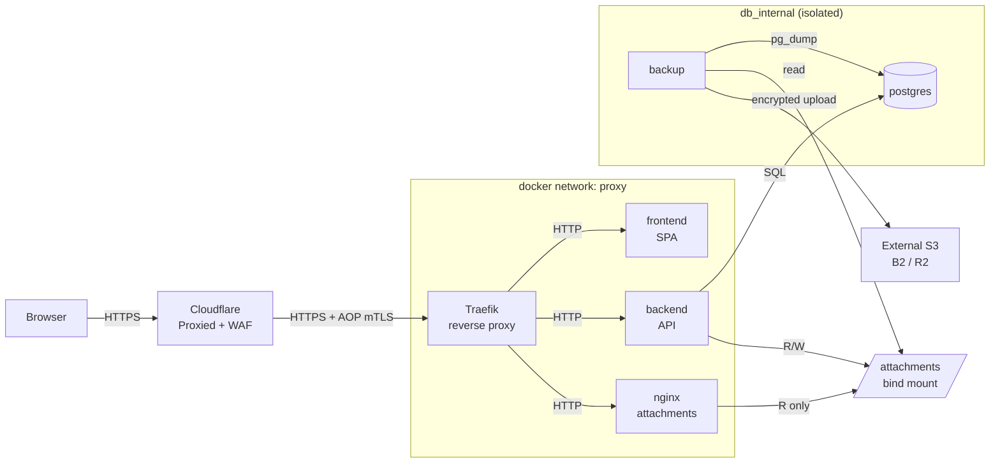

# BugShot — Deployment

Skrócona instrukcja deploy prod na jeden VPS z zewnętrznym Traefikiem za Cloudflare.

## Architektura



Trzy subdomeny na jeden VPS:
- `bugshot.on-labs.dev` → frontend (SPA)
- `api.bugshot.on-labs.dev` → backend
- `fs.bugshot.on-labs.dev` → nginx (attachments + widgets)

## Struktura na VPS

```
/opt/
├── infra/traefik/          # osobny compose, wspólny reverse proxy dla wszystkich apps
│   ├── docker-compose.yml
│   ├── traefik.yml         # static config
│   ├── dynamic/            # global middlewares (secure-headers, cf-only, rate-limit, csp)
│   ├── certs/              # CF Origin Pull CA (dla mTLS AOP)
│   ├── letsencrypt/        # acme.json (chmod 600)
│   ├── logs/
│   └── .env                # CF_DNS_API_TOKEN
└── apps/bugshot/
    ├── docker-compose.yml
    ├── docker-compose.prod.yml
    ├── .env.prod           # chmod 600
    └── bug-shot-attachments/   # chown 10001:10001
```

## Prerequisites

- VPS: Debian/Ubuntu, ≥2 vCPU, ≥4 GB RAM, statyczny IP
- Docker Engine + Compose v2.20+ (dla `!reset`)
- Domena w CF (proxied), token API z `Zone:Zone:Read + Zone:DNS:Edit`
- Zewnętrzny S3: Backblaze B2 lub Cloudflare R2

## Setup w kolejności

### 1. Cloudflare

- Domain w CF, nameservery zmienione w rejestratorze, DNSSEC **off** przed migracją
- SSL/TLS mode: **Full (strict)**
- Always Use HTTPS: ON, Min TLS 1.2
- DNS records (wszystkie Proxied 🟠):
  - `A on-labs.dev → <VPS_IP>` (apex)
  - `A * → <VPS_IP>` (wildcard, opcjonalnie)
  - `A api.bugshot → <VPS_IP>`
  - `A fs.bugshot → <VPS_IP>`
  - `A traefik → <VPS_IP>` (dashboard)
- API Token: My Profile → API Tokens → Create Custom Token
  - Permissions: `Zone:Zone:Read` + `Zone:DNS:Edit`
  - Zone: konkretna (`on-labs.dev`), NIE `All zones`
  - Expiration: 1 year (kalendarz na rotację)
  - Client IP filtering: pusty (albo VPS IP jeśli statyczny)

### 2. Traefik

```bash
cd /opt/infra/traefik
# Skopiuj traefik.yml, dynamic/, docker-compose.yml
echo "CF_DNS_API_TOKEN=<token>" > .env
chmod 600 .env
touch letsencrypt/acme.json && chmod 600 letsencrypt/acme.json
docker compose up -d
```

Weryfikacja:
```bash
docker logs traefik --since 1m | grep -Ei "obtained|error"
# szukamy: Obtained certificate for domains [traefik.on-labs.dev]
```

### 3. BugShot

```bash
cd /opt/apps/bugshot
# Wypełnij .env.prod (patrz sekcja Env Vars)
chmod 600 .env.prod
mkdir -p bug-shot-attachments
sudo chown -R 10001:10001 bug-shot-attachments

docker compose --env-file .env.prod \
  -f docker-compose.yml -f docker-compose.prod.yml \
  build --pull

docker compose --env-file .env.prod \
  -f docker-compose.yml -f docker-compose.prod.yml \
  up -d
```

Po pierwszym starcie: **hasło postgres w bazie ≠ env** jeśli zmienialiście już `.env.prod`. Postgres image ustawia `POSTGRES_PASSWORD` TYLKO przy inicjalizacji volumu. Ręczny reset:

```bash
docker compose --env-file .env.prod \
  -f docker-compose.yml -f docker-compose.prod.yml \
  exec postgres psql -U bugshot -d bugshot
# w psql:
\password bugshot
# wpisz nowe hasło (z .env.prod), dwa razy
\q
```

Force-recreate backend+backup żeby wczytały env:
```bash
docker compose --env-file .env.prod \
  -f docker-compose.yml -f docker-compose.prod.yml \
  up -d --force-recreate backend backup
```

## Env Vars (`.env.prod`)

| Zmienna | Sens | Jak generować |
|---|---|---|
| `POSTGRES_DB` / `POSTGRES_USER` | Baza + user | Dowolnie (np. `bugshot`) |
| `POSTGRES_PASSWORD` | Hasło DB | `openssl rand -hex 32` — **hex, NIE base64** (znaki `+/=` łamią connection strings) |
| `BACKEND_APP_DLL` | DLL do dotnet | `BugShot.Api.dll` |
| `APP_UID` | UID w kontenerze | `1654` (default aspnet) lub `10001` |
| `S3_ENDPOINT_URL` | Backup destination | `https://s3.eu-central-003.backblazeb2.com` |
| `S3_BUCKET`, `AWS_DEFAULT_REGION` | Backup bucket | zależnie od providera |
| `BACKUP_ACCESS_KEY_ID`, `BACKUP_SECRET_ACCESS_KEY` | S3 klucze | Application Key scoped do bucketu (NIE master) |
| `BACKUP_AGE_PUBLIC_KEY` | Klucz publiczny do szyfrowania | `age-keygen -o backup.key`, klucz PRYWATNY do password managera |
| `DISCORD_WEBHOOK_URL` | Backup fail alerts | webhook Discord (osobny na prod) |

## Backup + restore

Backup uruchamiany przez cron na hoście albo przez scheduled `docker compose exec`:

```bash
docker compose --env-file .env.prod \
  -f docker-compose.yml -f docker-compose.prod.yml \
  exec backup /scripts/backup-pg.sh

docker compose --env-file .env.prod \
  -f docker-compose.yml -f docker-compose.prod.yml \
  exec backup /scripts/backup-media.sh
```

Restore (przywracanie z age-encrypted dump):

```bash
# Pobierz z S3
aws s3 cp s3://bugshot-prod-backups/pg/YYYY-MM-DD.sql.gz.age /tmp/

# Odszyfruj (potrzebny prywatny klucz age)
age -d -i backup.key /tmp/YYYY-MM-DD.sql.gz.age > /tmp/dump.sql.gz

# Restore
gunzip -c /tmp/dump.sql.gz | docker compose --env-file .env.prod \
  -f docker-compose.yml -f docker-compose.prod.yml \
  exec -T postgres psql -U bugshot -d bugshot
```

## Upgrade path

**Domyslnie: automatycznie przez CI/CD.** Merge do `main` z commitem
`feat:`/`fix:` → `release.yaml` wylicza wersje, retaguje obrazy, tworzy tag `v*`
i **sam dispatchuje** `deploy-prod.yaml`, ktory robi rolling deploy na VPS
(sync plikow repo do taga + `docker pull` obrazow `:<ver>` + healthcheck + smoke
+ auto-rollback). Pelny opis: [pipeline.md](pipeline.md).

VPS **nie wymaga juz recznego `git pull`** — krok deployu sam robi na serwerze
`git fetch --tags` + `git checkout -f v<version>`, synchronizujac compose,
`nginx.conf` i entrypointy do dokladnie deployowanej wersji (`.env.prod` i inne
pliki nietrackowane zostaja nietkniete).

Reczny deploy istniejacej wersji (np. gdy chcesz cofnac/wymusic konkretny tag):
```bash
gh workflow run deploy-prod.yaml -f version=0.0.2
```

Awaryjny deploy bezposrednio na VPS (gdy CI niedostepne):
```bash
cd /opt/apps/bugshot
git fetch --tags && git checkout -f v<version>
export BACKEND_IMAGE=ghcr.io/<owner>/bugshot-backend:<version>
export FRONTEND_IMAGE=ghcr.io/<owner>/bugshot-frontend:<version>
export BACKUP_IMAGE=ghcr.io/<owner>/bugshot-backup:<version>
docker compose --env-file .env.prod \
  -f docker-compose.yml -f docker-compose.prod.yml \
  pull backend frontend backup
docker compose --env-file .env.prod \
  -f docker-compose.yml -f docker-compose.prod.yml \
  up -d --no-build --remove-orphans
docker compose ps
```

Rollback: automatyczny przy porazce smoke, albo recznie przez `rollback.yaml`
(`gh workflow run rollback.yaml -f version=<prev> -f environment=prod`). Obrazy
sa taggowane semver w GHCR, wiec rollback nie wymaga rebuildu. Postgres migracje
wsteczne — sprawdz EF migrations przed downgrade.

## Troubleshooting — realne przypadki

### 526 Invalid SSL certificate na CF

Origin nie ma certa dla tego hosta. Sprawdź:
```bash
docker exec traefik grep -oE '"main"\s*:\s*"[^"]*"' /letsencrypt/acme.json
docker logs traefik --since 5m | grep -iE "acme|error"
```

Typowe: literówka w Host() rule (`bushot` zamiast `bugshot`), brak DNS record dla subdomeny, CF token bez `Zone:Zone:Read`.

### Traefik nie widzi nowego kontenera mimo poprawnych labels

Docker event mogl sie zgubic. Fix:
```bash
cd /opt/infra/traefik
docker compose down
docker compose up -d
```

Jak dalej nie widzi — dodaj router explicit w `dynamic/<service>.yml` (file provider zamiast docker):
```yaml
http:
  routers:
    myapp:
      rule: "Host(`app.example.com`)"
      entryPoints: ["websecure"]
      service: myapp
      tls: {certResolver: le}
  services:
    myapp:
      loadBalancer:
        servers:
          - url: "http://myapp-container-name:8080"
```

### Backend `unhealthy` mimo że `/healthz` odpowiada

Base image `mcr.microsoft.com/dotnet/aspnet` nie ma `wget`/`curl`. Fix — dodaj do Dockerfile:
```dockerfile
# hadolint ignore=DL3008
RUN apt-get update && apt-get install -y --no-install-recommends curl \
 && rm -rf /var/lib/apt/lists/*
```
Healthcheck: `["CMD", "curl", "-fsS", "http://127.0.0.1:8080/healthz"]`.

### nginx crash z `chown ... Operation not permitted`

Read-only rootfs + docker-entrypoint próbuje modyfikować `/etc/nginx/conf.d`. Fix w prod override:
```yaml
    user: "101:101"
    entrypoint: ["nginx", "-g", "daemon off;"]
    tmpfs:
      - /var/cache/nginx:rw,size=32m,uid=101,gid=101
      - /var/run:rw,size=8m,uid=101,gid=101
    sysctls:
      - net.ipv4.ip_unprivileged_port_start=0
    cap_add: [NET_BIND_SERVICE]
```

### Postgres password authentication failed mimo że env vars się zgadzają

Postgres image ustawia `POSTGRES_PASSWORD` TYLKO przy inicjalizacji volumu. Zmiana `.env.prod` po pierwszym starcie NIE zmienia hasła w bazie. Fix: `\password` w psql (patrz sekcja Setup).

**Uwaga na test**: `psql -h localhost -U bugshot` **puszcza bez hasła** (pg_hba `127.0.0.1/32 trust`). Do testu scram-sha-256 użyj `-h postgres` (docker DNS).

### `Invalid API Token` na CF

Dwa typy tokenów, różne verify endpointy:
- User API Token (My Profile) → `/user/tokens/verify`
- Account API Token (Manage account, prefix `cfat_`) → `/accounts/{id}/tokens/verify`

Test funkcjonalny (co Traefik/lego naprawdę potrzebuje):
```bash
curl -sS "https://api.cloudflare.com/client/v4/zones?name=on-labs.dev" \
  -H "Authorization: Bearer $CF_DNS_API_TOKEN" | jq .success
```

### `docker-compose` merge dołącza `traefik.enable=false` z base'a

Compose `labels:` łączy jako listę (concat, nie replace). Jeśli base ma `traefik.enable=false` a override `=true`, oba trafiają do container labels. Docker mapuje na klucz — last wins. Fix jak coś się myli: `labels: !reset` w override.

## Security checklist prod

- [ ] `.env.prod` chmod 600, właściciel root albo deployer, NIE w repo
- [ ] `acme.json` chmod 600
- [ ] `POSTGRES_PASSWORD` = `openssl rand -hex 32` (min 32 znaki)
- [ ] `BACKUP_AGE_PUBLIC_KEY` w env, klucz **prywatny** w password managerze poza VPS
- [ ] CF Authenticated Origin Pulls: ON (SSL/TLS → Origin Server)
- [ ] Trivy scan HIGH/CRITICAL: 0 (blocker w CI)
- [ ] Firewall (ufw): 443 tylko z CF ranges, 80 zamknięty (ACME przez DNS-01), 22 z allowlist
- [ ] Postgres w `internal: true` network, brak `ports:` na hoście
- [ ] Non-root user we wszystkich kontenerach aplikacyjnych
- [ ] `read_only: true` + `cap_drop: [ALL]` + `no-new-privileges`
- [ ] Log rotation: json-file 10m × 3
- [ ] Backup tested end-to-end (dump → S3 → decrypt → restore w staging)
- [ ] CF API token expiration w kalendarzu (rotacja przed wygaśnięciem)
