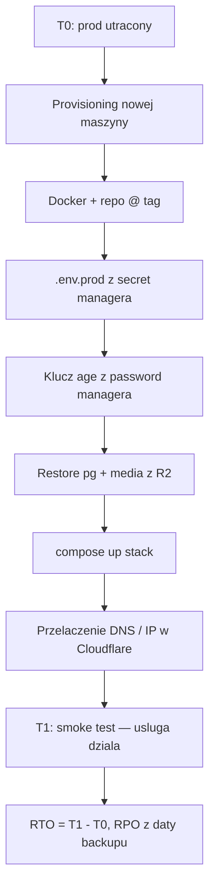

# BugShot — Disaster Recovery (DR) drill

Procedura odtworzenia produkcji po calkowitej utracie maszyny: **restore z
zaszyfrowanego backupu na NOWY serwer w < 1h**. Uzupelnia [backup.md](backup.md)
(jak dzialaja backupy) i [deployment.md](deployment.md) (jak postawic serwer).
Ten dokument to *drill* — swiadomie przeprowadzona proba, nie tylko teoria.

## Cel i cele czasowe

| Metryka | Definicja | Cel |
|---|---|---|
| **RTO** (Recovery Time Objective) | max czas od utraty prod do zweryfikowanego dzialania na nowej maszynie | **< 1h** |
| **RPO** (Recovery Point Objective) — Postgres | max utrata danych = wiek ostatniego dobrego backupu pg | ≤ 24h (backup pg codziennie 03:00 UTC) |
| **RPO** — media/attachments | jw. dla mediow | ≤ 7 dni (media co niedziela 04:00 UTC) |

RPO wynika z harmonogramu backupow ([backup.md](backup.md#schedule)). Zeby go
poprawic — zwieksz czestotliwosc `backup-pg.sh` w cronie kontenera backup.

## Scenariusz drillu

Symulujemy **calkowita utrate VPS prod** (dysk nie do odzyskania). Dostepne sa
wylacznie:
- zaszyfrowane obiekty w buckecie S3/R2 (`pg/*.sql.gz.age`, `media/*.tar.gz.age`),
- **private key age** z password managera (offline),
- repo z tagiem release + obrazy w GHCR,
- sekrety prod (`.env.prod`) z secret managera.

Jesli restore uda sie z SAMYCH tych rzeczy — DR dziala. Jesli czegokolwiek
brakuje (np. klucza) — to jest ustalenie drillu, nie porazka „w boju".



## Prerequisites (przed drillem)

- [ ] **Nowa maszyna** gotowa do provisioningu (osobny VPS albo swiezy VM/kontener
      — Debian/Ubuntu, ≥2 vCPU, ≥4 GB RAM). NIE ta sama co prod.
- [ ] **Private key age** w password managerze — znasz sciezke/wpis i masz dostep.
- [ ] **Dostep do bucketu** — R2/B2 token (Object Read) + `S3_ENDPOINT_URL`, `S3_BUCKET`.
- [ ] **`.env.prod`** dostepny z secret managera (NIE z repo).
- [ ] **Dostep do Cloudflare** (przelaczenie rekordu A na nowy IP) — dla pelnego drillu.
- [ ] Zegar/stoper (albo `date +%s` na starcie i koncu) do pomiaru RTO.

> **Wariant „lite" (bez przelaczania DNS):** jesli nie chcesz ruszac prod DNS,
> zrob drill na tymczasowej subdomenie (`dr.bugshot.on-labs.dev`) albo lokalnie z
> wpisem w `/etc/hosts`. RTO liczysz do mo, gdy smoke test przechodzi na nowej
> maszynie — przelaczenie DNS jest wtedy „krokiem 0" liczonym osobno.

## Procedura krok po kroku

Zapisz `T0=$(date -u +%s)` w momencie „ogloszenia utraty prod".

### 1. Provisioning maszyny (cel: ~10 min)
```bash
# na nowej maszynie, jako root/sudo
apt-get update && apt-get install -y ca-certificates curl git age
curl -fsSL https://get.docker.com | sh          # Docker Engine + Compose plugin
```

### 2. Repo w wersji release (cel: ~2 min)
```bash
mkdir -p /opt/apps && cd /opt/apps
git clone https://github.com/MarshallBjorn/bug-shot.git bugshot
cd bugshot
git fetch --tags
git checkout -f v<VERSION>          # ten sam tag, co ostatni dobry prod
```

### 3. Sekrety prod (cel: ~3 min)
```bash
cd /opt/apps/bugshot
# wklej .env.prod z secret managera (NIE z repo)
install -m 600 /dev/stdin .env.prod <<'EOF'
# ... zawartosc .env.prod ...
EOF
```

### 4. Klucz age z password managera — TEST (cel: ~2 min)
To osobny punkt AC: potwierdzamy, ze klucz z PM faktycznie odszyfrowuje.
```bash
# wklej private key z password managera do pliku o restrykcyjnych prawach
install -m 600 /dev/stdin /root/backup.age-key <<'EOF'
AGE-SECRET-KEY-1........
EOF
# szybki test: klucz jest poprawny i pasuje do public key uzywanego w prod
age-keygen -y /root/backup.age-key      # wypisze public key -> porownaj z BACKUP_AGE_PUBLIC_KEY
```
Jesli wypisany public key == `BACKUP_AGE_PUBLIC_KEY` z `.env.prod` — klucz jest ten
wlasciwy. (Pelny dowod nastepuje w kroku 5 przy realnym `age -d`.)

### 5. Restore Postgres (cel: ~15 min, zalezy od rozmiaru)
```bash
export $(grep -E '^(S3_|AWS_)' .env.prod | xargs)   # S3_ENDPOINT_URL, S3_BUCKET, AWS_*

# najnowszy dobry dump pg
LATEST=$(aws s3 ls "s3://${S3_BUCKET}/pg/" --endpoint-url "$S3_ENDPOINT_URL" \
          | sort | tail -1 | awk '{print $4}')
echo "Odtwarzam: $LATEST   (to jest Twoj RPO — zanotuj date z nazwy)"

aws s3 cp "s3://${S3_BUCKET}/pg/${LATEST}" ./ --endpoint-url "$S3_ENDPOINT_URL"

# podnies TYLKO postgres z docelowej wersji
COMPOSE="docker compose --env-file .env.prod -f docker-compose.yml -f docker-compose.prod.yml"
export BACKEND_IMAGE=ghcr.io/marshallbjorn/bugshot-backend:<VERSION>
export FRONTEND_IMAGE=ghcr.io/marshallbjorn/bugshot-frontend:<VERSION>
export BACKUP_IMAGE=ghcr.io/marshallbjorn/bugshot-backup:<VERSION>
$COMPOSE up -d postgres
$COMPOSE exec -T postgres sh -c 'until pg_isready -U "$POSTGRES_USER"; do sleep 1; done'

# deszyfracja + restore streamem (plaintext nie dotyka dysku)
age -d -i /root/backup.age-key < "$LATEST" \
  | gunzip \
  | $COMPOSE exec -T postgres psql -U bugshot -d bugshot
```
> Dump robiony jest z `--clean --if-exists` ([backup-pg.sh](../backup/scripts/backup-pg.sh)),
> wiec restore nadpisuje schemat bez recznego czyszczenia bazy.

### 6. Restore mediow (cel: ~5–15 min)
```bash
LATEST_MEDIA=$(aws s3 ls "s3://${S3_BUCKET}/media/" --endpoint-url "$S3_ENDPOINT_URL" \
                | sort | tail -1 | awk '{print $4}')
aws s3 cp "s3://${S3_BUCKET}/media/${LATEST_MEDIA}" ./ --endpoint-url "$S3_ENDPOINT_URL"

mkdir -p bug-shot-attachments && chown -R 10001:10001 bug-shot-attachments
age -d -i /root/backup.age-key < "$LATEST_MEDIA" | tar xzf - -C bug-shot-attachments/
```

### 7. Podniesienie calego stacku (cel: ~5 min)
```bash
$COMPOSE pull backend frontend backup
$COMPOSE up -d --no-build --remove-orphans
$COMPOSE ps
```
> Wymaga tez postawionego Traefika (patrz [deployment.md](deployment.md#2-traefik)).
> Na czas drillu mozesz odpalic minimalny Traefik albo testowac przez port/`/etc/hosts`.

### 8. Przelaczenie ruchu (cel: ~5 min, wariant pelny)
Zmien rekord `A` (apex + subdomeny) w Cloudflare na IP nowej maszyny. Propagacja
przez CF jest natychmiastowa (proxied). W wariancie „lite" — pomijasz, testujesz
lokalnie.

### 9. Smoke test i STOP zegara
```bash
$COMPOSE exec -T backend curl -fsS http://127.0.0.1:8080/healthz
$COMPOSE exec -T frontend wget -qO- http://127.0.0.1/healthz
# funkcjonalnie: zaloguj sie, otworz projekt, sprawdz ze zgloszenia i attachmenty sa

T1=$(date -u +%s); echo "RTO = $(( (T1 - T0) / 60 )) min $(( (T1 - T0) % 60 )) s"
```

## Wyniki drillu (do wypelnienia po kazdym przebiegu)

| Data drillu | Wykonal | RTO (zmierzone) | RPO pg (data dumpu) | RPO media | Klucz age z PM OK? | SBOM sprawdzony? | Uwagi / bottleneck |
|---|---|---|---|---|---|---|---|
| _RRRR-MM-DD_ | _kto_ | _np. 42 min_ | _np. 2026-09-22 (−9h)_ | _np. 2026-09-20_ | ☐ | ☐ | _co spowolnilo, co poprawic_ |

> **To NIE jest opcjonalne** — AC wymaga zmierzonych i ZAPISANYCH RTO/RPO. Po
> kazdym drillu dopisz wiersz. Trend RTO w czasie = dowod, ze procedura sie
> skaluje i nie gnije.

## Test „czy klucz age z password managera dziala"

Pokryty krokiem 4 (porownanie public key) + krokiem 5 (realny `age -d`). Zaliczone,
gdy: (a) `age-keygen -y` z klucza z PM == `BACKUP_AGE_PUBLIC_KEY`, oraz (b) `age -d`
odszyfrowal dump i `psql` go przyjal bez bledu. Zaznacz w tabeli wynikow.

## SBOM (Software Bill of Materials)

Kazdy release ma dolaczone SBOM-y (SPDX JSON) jako assety GitHub Release — po
jednym na obraz: `sbom-backend-<ver>.spdx.json`, `sbom-frontend-<ver>.spdx.json`,
`sbom-backup-<ver>.spdx.json`. Generuje je `syft` w jobie `sbom`
([release.yaml](../.github/workflows/release.yaml)).

Pobranie i uzycie (np. audyt CVE tego, co realnie jest na prod):
```bash
gh release download v<VERSION> --pattern 'sbom-*.spdx.json'
# skan podatnosci na podstawie SBOM (bez ponownego pullowania obrazu)
grype sbom:./sbom-backend-<VERSION>.spdx.json
```
SBOM „zamraza" dokladny sklad obrazu w chwili release — kluczowe przy DR i przy
reakcji na nowo ujawnione CVE („czy nas dotyczy ta biblioteka?").

## (Opcjonalnie) Podpisy obrazow — cosign

Job `sbom` ma gotowe kroki cosign (keyless, OIDC), domyslnie **wylaczone**.
Wlaczenie:
```bash
gh variable set ENABLE_COSIGN --body true
```
Weryfikacja podpisu po wlaczeniu:
```bash
cosign verify ghcr.io/marshallbjorn/bugshot-backend:<VERSION> \
  --certificate-identity-regexp '.*' \
  --certificate-oidc-issuer https://token.actions.githubusercontent.com
```

## Sprzatanie po drillu

- Wariant lite: `docker compose ... down -v` na maszynie drillowej, usun `backup.age-key`.
- Wariant pelny: przywroc rekordy DNS na oryginalny prod, potem posprzataj maszyne drillowa.
- **Zawsze:** `shred -u /root/backup.age-key` (albo usun wpis tymczasowy) — klucz
  prywatny nie zostaje na maszynie drillowej.

## Harmonogram

Drill **raz na kwartal** oraz po kazdej wiekszej zmianie w backup/restore albo w
schemacie bazy. Wpisz kolejny termin do kalendarza zespolu i dodaj wiersz do
tabeli wynikow po kazdym przebiegu.

## Mapowanie na AC (SPR4)

- [x] `docs/dr.md` opisuje procedure krok po kroku — ten dokument.
- [ ] Test restore na nowej maszynie, RTO/RPO zmierzone i zapisane — **wykonaj drill**, wpisz wiersz do tabeli wynikow.
- [ ] Deszyfrowanie klucza age z password managera przetestowane — kroki 4–5, zaznacz w tabeli.
- [x] SBOM dolaczany jako asset GitHub Release — job `sbom` (syft, SPDX JSON).
- [x] (opcjonalnie) Podpis cosign — gotowe za `ENABLE_COSIGN=true`.
