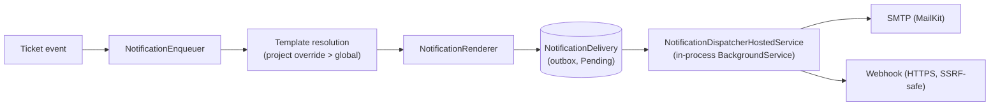

# Notifications

Email and webhook notifications for `TicketCreated`, `CommentAdded`, `StatusChanged`.

## Flow



The dispatcher runs **in-process** inside the API (`BugShot.Api`), not as a
separate container/process. There is nothing extra to deploy or start for it.

## Config

`SmtpOptions` accepts three equivalent naming schemes (checked in this
order of precedence): `Smtp:*` (appsettings section) → `SMTP_*`
(screaming-snake, incl. `SMTP_FROM_ADDRESS`) → `Smtp__*` (double-underscore,
what docker-compose/ASP.NET env-var binding produces). `SMTP_FROM` (no
`_ADDRESS`) is still accepted for backward compatibility, but
`SMTP_FROM_ADDRESS` takes precedence when both are set.

| Variable | Required | Default |
|---|---|---|
| `SMTP_HOST` / `Smtp__Host` | no | `localhost` |
| `SMTP_PORT` / `Smtp__Port` | no | `25` |
| `SMTP_USERNAME` / `Smtp__Username` | no | *(none)* |
| `SMTP_PASSWORD` / `Smtp__Password` | no | *(none)* |
| `SMTP_FROM_ADDRESS` / `Smtp__FromAddress` | no | `noreply@bug-shot.test` |
| `SMTP_FROM_NAME` / `Smtp__FromName` | no | `Bug-Shot` |
| `SMTP_USE_STARTTLS` / `Smtp__UseStartTls` | no | `false` |

Missing SMTP config does **not** stop the API from starting — email
delivery just fails at send time (retried per the normal retry policy,
eventually `Failed`). Webhook delivery has no dependency on SMTP config.

See `.env.example` / `.env.dev.example` / `.env.prod.example` for
copy-paste placeholders. Never commit real SMTP credentials — production
values live in `.env.prod` (gitignored) or your deployment's secret store.

## Webhook security

- HTTPS only (plain HTTP is rejected at channel create/update time).
- SSRF protection blocks loopback, link-local, and all RFC1918 ranges —
  this is enforced via a `SocketsHttpHandler.ConnectCallback` that checks
  the **actually-resolved IP** at connect time (`SsrfProtection.cs`), not
  just the URL string, so it is safe against DNS rebinding.
- 10s request timeout.
- Payload is signed with HMAC-SHA256 over the exact raw request bytes,
  sent as `X-Bugshot-Signature`.
- `WebhookSecret` never appears in any API response DTO.

Practical consequence: you **cannot** point a webhook channel at a
receiver running on `localhost` or inside the same Docker network — the
app will correctly reject it. Use a public HTTPS endpoint (e.g.
webhook.site) for manual live testing, or the automated Mailpit-based
E2E flow below for email.

## Retry & throttling

- 4 attempts total (initial + 3 retries), backoff `1m / 5m / 25m`.
- Claimed atomically via `FOR UPDATE SKIP LOCKED` — safe with multiple
  API replicas running the same background service.
- Webhook retries only on 5xx / network errors; 4xx is a permanent failure
  (no retry).
- Throttling is per project + channel, configured as a pair
  (`ThrottleWindowSeconds` + `ThrottleMaxEvents`, both set or both null).
  Throttled events are dropped, not retried.

See `backend/BugShot.Api.Tests/Notifications/NotificationDispatcherTests.cs`
for the exact attempt/backoff/throttle assertions — those tests force
retries by rewriting `NextAttemptAt` into the past instead of waiting
real time, which is the pattern to follow for any new retry test.

## Template placeholders

`{{project.id}}` `{{project.name}}` `{{project.key}}` `{{ticket.id}}`
`{{ticket.description}}` `{{ticket.pageUrl}}` `{{ticket.status}}`
`{{ticket.reportedAt}}` `{{comment.author}}` `{{comment.body}}`
`{{status.from}}` `{{status.to}}` `{{status.changedBy}}`

Unknown tokens render as an empty string (tracked in
`RenderResult.MissingTokens`, not sent to the recipient). `comment.*` /
`status.*` tokens are only resolved for their matching event type — used
for another event type, they render empty and count as missing.
Default templates are seeded by migration `20260916074237_AddNotifications`
(global, `project_id = null`); projects can override per event/channel via
`PUT /api/v1/projects/{projectId}/notification-templates`.

## Local E2E (with real email)

`docker-compose.e2e.yml` is the isolated stack (Postgres `5435`, MinIO,
API `8085`, frontend `5175` — none of this touches the dev Postgres on
`5433`). It has no Mailpit by default. `docker-compose.notifications.e2e.yml`
is an **additive override** that adds a `mailpit-e2e` service and points
`backend-e2e` at it via `Smtp__*` env vars, without changing the base file.

```powershell
docker compose -f docker-compose.e2e.yml -f docker-compose.notifications.e2e.yml -p bugshot-e2e up -d --build
```

Mailpit UI: `http://localhost:8026`. This exact override is also wired
into `e2e/scripts/run-e2e.mjs` (the script `npm test` in `e2e/` runs, and
what CI's `e2e.yaml` workflow calls), so `npm test` in `e2e/` and CI both
get a working Mailpit automatically — no extra setup needed either place.
`tests/notifications-email.spec.ts` asserts a real `TicketCreated` email
arrives within 5s with correct From/To/Subject/Body via Mailpit's REST API.

Webhook delivery cannot use this local stack (see SSRF note above) — for
a live webhook proof use a public HTTPS endpoint and create the channel
against `demoProjectId` (`11111111-1111-1111-1111-111111111111`) via the
admin API or UI.
