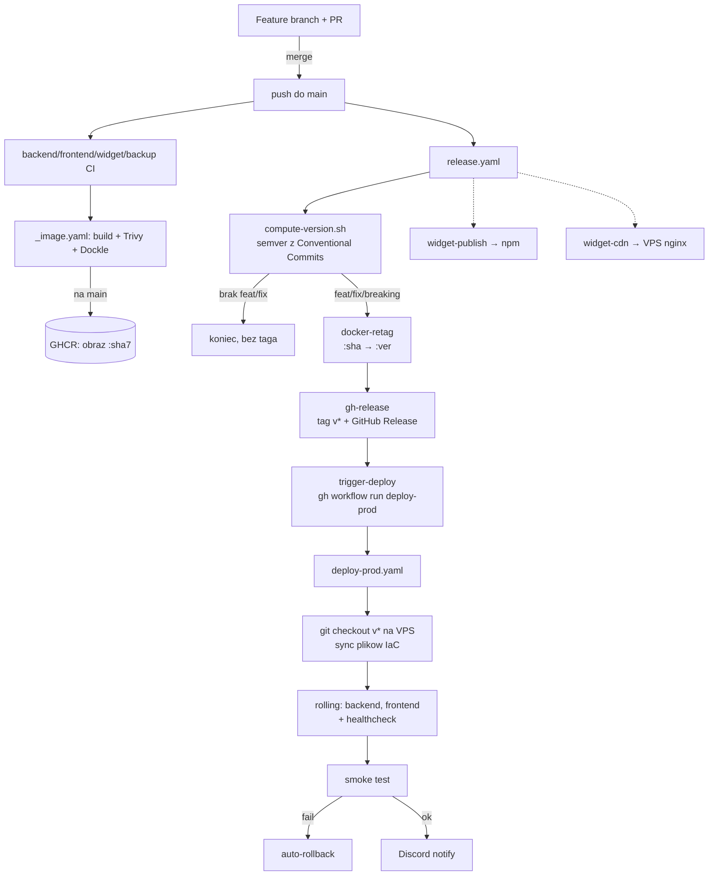

# BugShot — CI/CD Pipeline

Opis calego pipeline: od push na feature branch, przez merge do `main`,
automatyczne wyliczenie wersji, publikacje obrazow i widgetu, az po rolling
deploy na prod. Uzupelnienie [deployment.md](deployment.md) (to jest "jak dziala
automatyzacja", tamto jest "jak postawic serwer recznie").

## Mapa workflow

| Workflow | Trigger | Rola |
|---|---|---|
| `backend.yaml` / `frontend.yaml` / `widget.yaml` / `backup.yaml` | push (path-filtered) + PR | CI danego serwisu: test + lint + build obrazu (`_image.yaml`) |
| `_image.yaml` | `workflow_call` | Reuzywalny: build → Trivy + Dockle → push `:<sha7>` do GHCR (tylko na `main`) |
| `e2e.yaml` / `loadtest.yaml` | push / PR / manual | Testy end-to-end i obciazeniowe |
| `release.yaml` | push do `main` | Wylicza semver, retaguje obrazy `:<sha>`→`:<ver>`, publikuje widget, tworzy tag `v*` + GitHub Release, **dispatchuje deploy** |
| `deploy-prod.yaml` | push tagu `v*` **lub** `workflow_dispatch` | Rolling deploy na VPS + smoke + auto-rollback |
| `rollback.yaml` | `workflow_dispatch` | Reczny rollback prod do wskazanej wersji |

## Przeplyw calosciowy



Linie przerywane = odsprzegniete od sciezki krytycznej deployu: awaria npm/CDN
NIE blokuje utworzenia taga ani deployu prod.

## Wersjonowanie (semver, bez semantic-release)

**Nie uzywamy `semantic-release`.** Wersje liczy wlasny skrypt
[`scripts/release/compute-version.sh`](../scripts/release/compute-version.sh) na
bazie Conventional Commits.

Algorytm (job `version` w `release.yaml`):

1. Ostatni tag `vX.Y.Z` = `git tag -l 'v*' | sort -V | tail -1`.
2. Zakres analizy = `<ostatni-tag>..HEAD`.
3. Iteracja po commitach w zakresie z **`--no-merges`** i dopasowanie typu:

   | Commit | Bump |
   |---|---|
   | `feat!:` / `fix!:` lub `BREAKING CHANGE:` w body | **major** |
   | `feat:` | **minor** |
   | `fix:` | **patch** |
   | `chore:`, `docs:`, `ci:`, `refactor:`, ... | brak |

   Priorytet: `major > minor > patch`.
4. Brak commitow release-worthy → `should_release=false`, workflow konczy sie
   sukcesem **bez tworzenia taga**.

### Dwie pulapki, ktore realnie ugryzly

- **Merge commity sa ignorowane (`--no-merges`).** Jesli robisz
  `Merge ... develop -> main` z opisem `fix: ...`, ten opis **nie liczy sie**.
  Licza sie tylko pojedyncze commity WEWNATRZ mergowanej galezi. Zeby release
  ruszyl, feature branch musi zawierac commit `feat:`/`fix:` (nie tylko tytul PR
  i nie tylko wiadomosc merga).
- **Failujacy job = brak bumpa.** Jesli `release.yaml` sie wywala (np. lint,
  brak sekretu), tag nie powstaje i wersja "stoi" niezaleznie od commitow. Zawsze
  sprawdz zakladke Actions, a nie tylko `git tag`.

### Podglad lokalny (dry-run)

```bash
bash scripts/release/compute-version.sh          # co policzyłoby dla HEAD
bash scripts/release/release-dry-run.sh          # pełny podgląd bez publikacji
```

## release.yaml — joby po kolei

1. **version** — `compute-version.sh`, ustawia `should_release`, `next_version`,
   `last_tag`, `bump`.
2. **guard** — idempotencja i bezpieczny rerun. Rozpoznaje 4 stany: tag nie
   istnieje (start), tag == HEAD bez release (resume), tag == HEAD z release
   (complete → stop), tag na innym commicie (blad → stop recznie).
3. **docker-retag** — dla `backend`, `frontend` i `backup`: znajduje przez
   Actions API obraz `:<sha7>` dla HEAD (czeka na build jesli trwa), retaguje
   jako `:<next_version>` + `:latest` i pushuje do GHCR.
4. **widget-publish** *(odsprzegniete)* — `npm publish @bug-shot/widget@<ver>`.
   Skip z warningiem, gdy brak sekretu `NPM_TOKEN`.
5. **widget-cdn** *(odsprzegniete)* — build `dist/` + tar-over-ssh na VPS przez
   WireGuard do `~/bugshot-prod/bug-shot-widgets/v<ver>` oraz `/latest`.
6. **gh-release** — renderuje release notes
   ([`render-notes.sh`](../scripts/release/render-notes.sh)), tworzy tag `v<ver>`
   + GitHub Release. To finalny, idempotentny krok.
7. **trigger-deploy** — dispatchuje `deploy-prod.yaml` z wyliczona wersja
   (patrz nizej, dlaczego to osobny krok).
8. **sbom** *(odsprzegniete)* — `syft` skanuje obrazy `:<ver>` (backend,
   frontend, backup), generuje SPDX JSON i dolacza jako assety GitHub Release.
   Opcjonalnie podpisuje obrazy `cosign` (keyless) gdy `vars.ENABLE_COSIGN=true`.
   Szczegoly DR/SBOM: [dr.md](dr.md).

### Dlaczego deploy jest dispatchowany, a nie tryguje sie z push tagu

`deploy-prod.yaml` ma `on: push: tags: ['v*']`, ale tag tworzy `gh-release`
uwierzytelniony **`GITHUB_TOKEN`-em**. GitHub **celowo nie triguje nowych
workflow od zdarzen wygenerowanych `GITHUB_TOKEN`-em** (ochrona przed rekursja) —
dlatego push tagu z poziomu Actions nie odpalal deployu (tag powstawal, deploy
nie). `workflow_dispatch` i `repository_dispatch` to jedyne dwa wyjatki od tej
reguly, wiec job `trigger-deploy` robi `gh workflow run deploy-prod.yaml -f
version=<ver>`. Trigger `on: push: tags` zostaje jako sciezka dla tagow tworzonych
recznie/PAT-em.

> **Wariant "po ksiazce" (odlozony):** tworzyc tag pod PAT-em lub tokenem GitHub
> App zamiast `GITHUB_TOKEN`. Wtedy push tagu tryguje deploy naturalnie, bez
> osobnego joba, ale trzeba zarzadzac i rotowac token.

## deploy-prod.yaml

Trigger: push tagu `v*` (recznie/PAT) **albo** `workflow_dispatch` (input
`version`, uzywany przez `trigger-deploy` i do recznego deployu).

Kroki:

1. **WireGuard** — tunel do VPS (`.github/actions/wg-connect`).
2. **Sync plikow IaC** — na VPS: `git fetch --tags` + `git checkout -f
   v<version>`. Synchronizuje compose, `nginx.conf`, entrypointy itd. do
   **dokladnie** deployowanej wersji. To rozwiazuje incydent z pustym
   `/config.js` (nowy obraz + stary compose). Pliki nietrackowane (`.env.prod`)
   zostaja nietkniete.
3. **Rolling deploy** — `docker pull` obrazow `:<version>`, potem po kolei
   `backend`, `frontend`: `compose up -d --no-deps <svc>` + czekanie na
   `healthy` (24 × 5s). Zapis `.deploy-tag` (+ `.deploy-tag-prev`).
4. **Smoke test** — `/healthz` wewnatrz kontenerow (backend 8080, frontend 80) +
   Playwright smoke (`continue-on-error`).
5. **Auto-rollback** — przy porazce smoke: powrot do `.deploy-tag-prev`.
6. **Discord notify** — status deployu (zawsze).

## Rollback

Automatyczny (w `deploy-prod`, przy porazce smoke) **lub** reczny przez
`rollback.yaml` (`workflow_dispatch`): sprawdza czy obrazy `:<version>` istnieja
w GHCR, robi `docker pull` + `compose up` na wskazana wersje, smoke, Discord.

```bash
gh workflow run rollback.yaml -f version=0.0.1 -f environment=prod
```

## Publikacja widgetu — 3 kanaly

Widget (`@bug-shot/widget`) jest odsprzegniety od deployu aplikacji. Trzy
niezalezne kanaly, wszystkie sterowane z `release.yaml`:

| Kanal | Stan | Czego wymaga |
|---|---|---|
| **GitHub Release** | dziala | nic (job `gh-release`) |
| **CDN** (VPS nginx `/widgets/`) | mechanizm gotowy | secrety WG (sa) + repo variable `WIDGET_CDN_BASE_URL` (do release notes) + zgodne sciezki (patrz [To-do](#to-do)) |
| **npm** | wylaczone | secret `NPM_TOKEN` (brak) |

Szczegoly wlaczenia npm i CDN: sekcja [Widget: npm + CDN](#widget-npm--cdn).

## Sekrety i zmienne repo

| Nazwa | Typ | Uzycie |
|---|---|---|
| `WG_PRIVATE_KEY`, `WG_ENDPOINT`, `WG_PEER_PUBLIC_KEY`, `WG_RUNNER_ADDRESS`, `WG_VPS_ADDRESS` | secret | tunel WireGuard do VPS |
| `DEPLOY_SSH_KEY`, `SSH_PORT` | secret | SSH na VPS |
| `DISCORD_WEBHOOK_URL` | secret | powiadomienia deploy/rollback/backup |
| `NPM_TOKEN` | secret | **brak** — potrzebny do `npm publish` widgetu |
| `WIDGET_CDN_BASE_URL` | variable | **brak** — bazowy URL CDN w release notes |
| `VPS_DEPLOY_PATH` | variable | baza deployu na VPS dla CDN (fallback `/opt/apps/bugshot`) |
| `ENABLE_COSIGN` | variable | `true` wlacza podpisy cosign w jobie `sbom` (domyslnie OFF) |
| `GITHUB_TOKEN` | auto | GHCR push/retag, gh-release, dispatch deployu, SBOM upload |

Sprawdzenie stanu:
```bash
gh secret list
gh variable list
```

## Widget: npm + CDN

### npm — jak wlaczyc

1. Konto/organizacja npm ze scope `@bug-shot` (dla publicznego pakietu scoped
   organizacja jest darmowa). Musisz miec prawo publikacji w tym scope.
2. Wygeneruj **Automation token**: npmjs.com → Access Tokens → Generate New Token
   → *Automation* (dziala z 2FA w CI).
3. Dodaj jako secret repo:
   ```bash
   gh secret set NPM_TOKEN
   ```
4. Nastepny release automatycznie opublikuje `@bug-shot/widget@<ver>`
   (`package.json` ma juz `"private": false` i `publishConfig.access: public`;
   wersje ustawia CI z `next_version`, wiec `0.0.0` w repo jest OK).

Weryfikacja: `npm view @bug-shot/widget version`.

### CDN — jak wlaczyc i uzywac

Mechanizm juz jest: job `widget-cdn` buduje `dist/` i wgrywa je na VPS, a
`nginx.conf` ma `location /widgets/` z szerokim CORS (`*`) i cache
(`v<ver>` = immutable 1 rok, `latest` = 5 min). Do pelnego dzialania:

1. **Ustaw bazowy URL** (do release notes; serwuje subdomena `fs`):
   ```bash
   gh variable set WIDGET_CDN_BASE_URL --body https://fs-bugshot.on-labs.dev/widgets
   ```
2. **Sprawdz zgodnosc sciezek** — patrz [To-do](#to-do): job wgrywa do
   `~/bugshot-prod/bug-shot-widgets`, a nginx montuje `./bug-shot-widgets`
   (`/opt/apps/bugshot/bug-shot-widgets`). Musza wskazywac ten sam katalog.
3. Osadzenie na cudzej stronie:
   ```html
   <script src="https://fs-bugshot.on-labs.dev/widgets/latest/widget.js" defer></script>
   ```
   Dla stabilnosci przypnij wersje: `/widgets/v0.0.2/widget.js`.

## To-do

- [x] **backup do CD** — zrobione: `docker-retag` retaguje takze `backup`, prod
  compose ma `image: ${BACKUP_IMAGE}` + `build: !reset null`, a `deploy-prod` i
  `rollback` ustawiaja i pobieraja `BACKUP_IMAGE`. Backup to job wsadowy — bez
  health-gatingu, podnosi go koncowy `compose up`.
- [x] **CDN: sciezka jako zmienna** — zrobione w kodzie: `widget-cdn` uzywa
  `${VPS_DEPLOY_PATH:-/opt/apps/bugshot}/bug-shot-widgets` (ten sam katalog co
  bind-mount nginx). **Zostaje**: `gh variable set VPS_DEPLOY_PATH --body /opt/apps/bugshot`.
- [ ] **npm**: ustawic `NPM_TOKEN`.
- [ ] **CDN**: ustawic `WIDGET_CDN_BASE_URL`.
- [ ] **(opcjonalnie) wariant B** — tag pod PAT/GitHub App, aby usunac job
  `trigger-deploy` i wrocic do czystego `on: push: tags`.
- [ ] **Refaktor na reuzywalne workflow** — `deploy-prod`/`rollback` maja duzo
  wspolnego kodu (WG, ssh, smoke, Discord); wydzielic wzorem `_image.yaml`.
