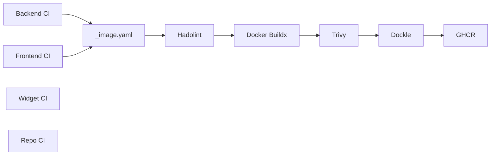
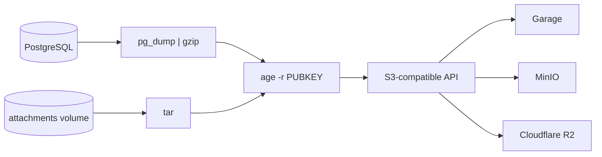
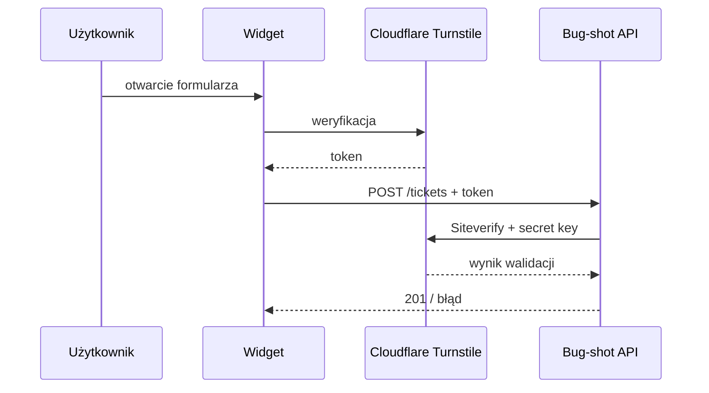

# Bug-shot: CI/CD, Garage S3 i Cloudflare Turnstile

Notatka opisuje trzy elementy dotykające infrastruktury Bug-shot: obecny pipeline CI/CD, Garage jako self-hosted backend S3 oraz Cloudflare Turnstile jako możliwą ochronę widgetu. Dla Garage dołączony jest wynik lokalnej weryfikacji.

## CI/CD

Repozytorium ma osobne workflowy dla backendu, frontendu, widgetu i samego repo. Budowanie obrazów Docker dla backendu i frontendu jest wspólne, w postaci reusable workflow `_image.yaml`.

### Backend

Workflow odpala PostgreSQL jako service container i wykonuje `dotnet restore`, `dotnet build`, migracje EF Core, `dotnet test`. Po zielonych testach wchodzi wspólny workflow budowania obrazu.

### Frontend

Node.js 24. Pipeline uruchamia `npm ci`, potem lint, build i test, a wynik trafia do tego samego `_image.yaml` co backend.

### Widget

Widget jest osobnym artefaktem JS/HTML, bez własnego obrazu Docker. Walidacja to `node --check`, walidacja HTML oraz testy/build zależne od konfiguracji pakietu. Dystrybucja przez NPM i własny CDN jest osobnym etapem, nie częścią głównego pipeline'u aplikacji.

### Repo

Osobny workflow, niezależny od testów aplikacji: `actionlint`, Gitleaks, Trivy secret scan.

### Obrazy Docker

`_image.yaml` odpowiada za pięć kroków: Hadolint sprawdza Dockerfile, Docker Buildx buduje obraz, Trivy skanuje podatności, Dockle sprawdza zgodność z dobrymi praktykami obrazu, na końcu publikacja do GHCR. Tag obrazu to skrócony SHA commita. Publikacja odbywa się po przejściu wymaganych kontroli na głównej gałęzi.

### CI vs CD

To, co jest dzisiaj, to CI plus publikacja obrazu do GHCR. Automatyczne wdrożenie na docelowy serwer (CD) nie istnieje jeszcze w pipeline. Docelowo mogłoby to wyglądać jako `docker compose pull` na VPS po nowym tagu, ale sposób uwierzytelnienia, mechanizm deployu, healthcheck i rollback to osobny temat do ustalenia przy implementacji.

## Garage S3

Garage to self-hosted object storage zgodny z API S3. Dla Bug-shot interesujące jest przede wszystkim to, że mówi tym samym protokołem co MinIO (obecny backend developerski) i Cloudflare R2 (potencjalny backend produkcyjny), więc może zostać podłączony do istniejącej warstwy backupu przez konfigurację zmiennych środowiskowych, bez zmiany samej logiki skryptów.

Warto rozróżnić dwie rzeczy, które łatwo pomylić: storage załączników ticketów i storage backupów. Załączniki (screenshoty, logi konsoli, pliki użytkownika) leżą dziś na wolumenie Docker i są serwowane przez nginx spod `/attachments/`, PostgreSQL trzyma tylko `uri`. Garage w to miejsce nie wchodzi, przeniesienie załączników z wolumenu do object storage byłoby osobną integracją (przechowywanie obiektów, pobieranie, uprawnienia, migracja istniejących danych). Garage pasuje do drugiej rzeczy, czyli warstwy backupowej opisanej w `docs/backup.md`.

Kontener backupu i tak łączy się z bucketem wyłącznie przez zmienne `S3_ENDPOINT_URL`, `S3_BUCKET`, `AWS_ACCESS_KEY_ID`, `AWS_SECRET_ACCESS_KEY`, `AWS_DEFAULT_REGION`. Podpięcie Garage sprowadza się do ustawienia tych wartości, bez zmiany skryptów `backup-pg.sh` / `backup-media.sh`.

| Backend | Środowisko | Rola |
|---|---|---|
| MinIO | Development | obecny backend dev opisany w `docker-compose.dev.yml` |
| Garage | Development / test | alternatywny self-hosted backend do testów zgodności S3 |
| Cloudflare R2 | Production | rozważany backend produkcyjny, zarządzany |

Garage nie zastępuje MinIO od razu, może działać obok niego jako dodatkowy backend do testów kompatybilności S3.

### Weryfikacja lokalna

Garage uruchomiony lokalnie jako pojedynczy node, wersja `v2.3.0`. Sprawdzone kroki: start serwera, utworzenie bucketu, uwierzytelnienie, upload obiektu, listowanie bucketu, download obiektu, porównanie SHA-256 pliku źródłowego z pobranym. Suma kontrolna się zgadzała, czyli podstawowy przepływ upload/download działa poprawnie z Garage. To test pojedynczego node'a, nie test klastra ani wysokiej dostępności, te tematy zostają poza obecną weryfikacją.

## Cloudflare Turnstile

Turnstile to usługa Cloudflare do ochrony formularzy przed automatycznym ruchem, bez captchy widocznej dla użytkownika w większości przypadków. Dla Bug-shot ma sens jako dodatkowa warstwa przed `POST /tickets`, bo widget jest publicznym komponentem osadzanym na cudzych domenach i to ten endpoint tworzy zgłoszenie na podstawie danych z przeglądarki użytkownika końcowego. Załączniki idą osobnym wywołaniem, `POST /tickets/{id}/attachments`, autoryzowanym jednorazowym `uploadToken` zwróconym z `POST /tickets`, więc weryfikacja Turnstile przy tworzeniu zgłoszenia pośrednio chroni też ten drugi krok, bo bez zgłoszenia nie ma tokenu do wysyłki plików.

Integracja ma dwie strony: `sitekey` trafia do widgetu i jest publiczny, `secret key` zostaje wyłącznie po stronie API i nigdy nie trafia do przeglądarki.

Proponowany przepływ integracji z `POST /tickets`: widget renderuje Turnstile, dostaje token, dokłada go do body razem z `projectKey`, `description` i resztą danych zgłoszenia. API po stronie serwera wykonuje `Siteverify` (`POST https://challenges.cloudflare.com/turnstile/v0/siteverify`) z tokenem i secret key, dopiero po pozytywnym wyniku tworzy ticket. Token ma limit 2048 znaków, jest ważny 300 sekund i jednorazowy, więc powtórna próba z tym samym tokenem musi zostać odrzucona.

Sensownym punktem startowym jest tryb `Managed`, gdzie Cloudflare sam dobiera poziom weryfikacji na podstawie ruchu i ogranicza widoczną interakcję tam, gdzie nie jest potrzebna.

Turnstile ma być opcjonalny per projekt, spójnie z tym, jak `docs/api.md` traktuje inne ustawienia projektowe (`project_origins`, reguły sanityzacji) - konfiguracja Turnstile dla danego projektu mogłaby być trzymana obok tych ustawień, bez narzucania na razie konkretnego kształtu tabel.

Cloudflare udostępnia testowe klucze, które pozwalają sprawdzić integrację bez używania kluczy produkcyjnych. Te klucze nie powinny trafić do Production. Konfigurację (enabled, sitekey, secret) warto trzymać osobno dla Development, Staging i Production.

Ważne zastrzeżenie: Turnstile to dodatkowa warstwa anti-bot, nie zamiennik dla walidacji danych, rate limitingu, kontroli `Origin`, `X-ProjectKey` czy jednorazowego `uploadToken` przy załącznikach. Te mechanizmy (część już działa, część jest do dorobienia zgodnie z `docs/api.md`) zostają niezależnie od tego, czy Turnstile jest włączony.
